# 🤝 Contributing Guide

<div align="center">


**Standards and processes for contributing to the Clinical MLOps System.**

[⬅️ Back to Root](./README.md)

</div>

---

## 1. The "Zero-Trust" Philosophy

Contributing to a clinical system requires a mindset shift. We operate under a **Zero-Trust** architecture:

1. **Trust No Input**: Always validate data schemas.
2. **Trust No Dependency**: Pin all package versions.
3. **Trust No Environment**: Assume the network is hostile.

---

## 2. Development Workflow

We follow a strict **Feature Branch** workflow enforced by CI/CD gates.

```mermaid
graph LR
    Main[Main Branch] -->|Fork/Clone| Local[Local Dev]
    Local -->|Feature Branch| Feature[feat/new-model]
    
    subgraph "Development Loop"
        Feature -->|Write Code| Code[Code]
        Code -->|Make Validate| Test[Tests & Lints]
        Test -->|Fix| Code
    end
    
    Test -->|Pass| Push[Push to Origin]
    Push -->|Pull Request| PR[Open PR]
    PR -->|CI/CD Action| Gate{Validation Gate}
    
    Gate -- Fail --> Fix[Request Changes]
    Gate -- Pass --> Review[Human Review]
    Review --> Merge[Merge to Main]
    
    style Main fill:#e3f2fd,stroke:#1565c0
    style Local fill:#fff9c4,stroke:#fbc02d
    style Gate fill:#ffebee,stroke:#c62828
    style Merge fill:#e8f5e9,stroke:#2e7d32
```



---

## 3. Contribution Types

| Type | Prefix | Example |
| :--- | :--- | :--- |
| **New Feature** | `feat:` | `feat: Add XGBoost model support` |
| **Bug Fix** | `fix:` | `fix: Correct age validation range` |
| **User Interface** | `ui:` | `ui: Update dashboard contrast` |
| **Documentation** | `docs:` | `docs: Add architecture diagram` |
| **Refactor** | `refactor:` | `refactor: Optimize data ingestion` |

---

## 4. Definition of Done (DoD)

A Pull Request is only considered for review if:

- [ ] **Validation Passes**: `make validate` returns exit code 0.
- [ ] **Tests Added**: Unit tests cover new logic `pytest`.
- [ ] **Docs Updated**: READMEs reflect architectural changes.
- [ ] **No Secrets**: `commit-check` verifies no API keys are pushed.
- [ ] **Reproducible**: `dvc repro` runs successfully from a clean state.

---

## 5. Setup Guide

### Prerequisites

- Python 3.10+
- Docker & Docker Compose
- Git & DVC

### Quick Start

```bash
# 1. Fork & Clone
git clone https://github.com/iammohith/MLOps-System-For-Clinical-Treatment-Outcome-Prediction.git

# 2. Install Dev Dependencies
pip install -r requirements-dev.txt

# 3. Setup Pre-Commit Hooks (Recommended)
pre-commit install
```

---

## 6. Code of Conduct

Please review our [Code of Conduct](CODE_OF_CONDUCT.md). We are committed to a harassment-free experience for everyone.
