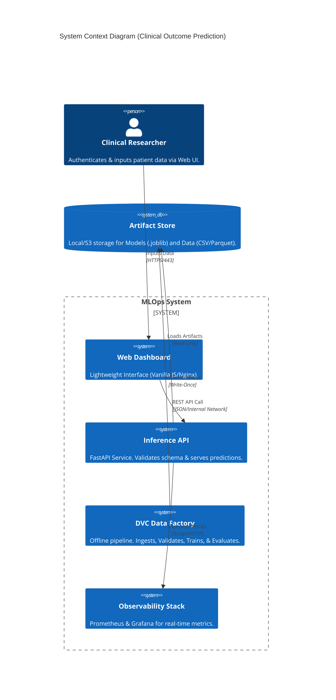

# 🏥 MLOps System: Clinical Treatment Outcome Prediction

<div align="center">


**A production-hardened, zero-trust MLOps system for predicting clinical treatment outcomes.**
*Engineered for Reliability, Reproducibility, and Scalability.*

</div>

---

## 📖 Project Title & Professional Description

**Clinical Treatment Outcome Prediction Module**

This repository houses a comprehensive **Medical Machine Learning Operations (MLOps)** system designed to predict the efficacy of pharmaceutical treatments based on patient demographics and clinical history.

Unlike experimental notebooks, this system is engineered as a **Modular Monolith** suitable for deployment in regulated healthcare environments. It features **deterministic data pipelines**, **hardened inference services**, and **full-stack observability**, ensuring that every prediction is traceable, auditable, and reliable.

---

## 🏗️ Architecture Overview

The system adheres to a **Zero-Trust** philosophy, validating data integrity at every stage of the lifecycle.

### System Context (C4 Model)



### Key Components

1. **DVC Pipelines**: Version-controlled data transformation DAGs (Independent of code).
2. **Inference Service**: High-performance FastAPI backend with Pydantic validation.
3. **Frontend Gateway**: 12-Factor app serving static assets via Nginx standards.
4. **Observability Sidecars**: Pre-configured Prometheus and Grafana for "Glass-Box" monitoring.

---

## 🚀 Features

### ✅ Clinical Reliability

* **Strict Schema Validation**: Enforces medical constraints (e.g., Age 0-100, valid Drug Names) via `params.yaml`.
* **Deterministic Training**: Byte-for-byte reproducibility using DVC content-addressable storage.
* **Model Versioning**: SHA-256 hash tracking for every deployed model artifact.

### ✅ Enterprise Security

* **Network Segregation**: Frontend and Backend are decoupled via an **Nginx Reverse Proxy**, hiding internal API topology.
* **Content Security Policy (CSP)**: Strict headers prevent XSS and data exfiltration.
* **Non-Root Execution**: All containers run as unprivileged users (`appuser` / `nginx`).

### ✅ Operational Excellence

* **Hybrid Execution**: Runs seamlessly on Bare Metal (Localhost) or Docker/Kubernetes.
* **Live Telemetry**: Real-time dashboards for Request Rate, Latency, and Model Drift.
* **Zero-Downtime Design**: Liveness/Readiness probes configured for K8s rolling updates.

---

## � Source Data Attribution

The clinical dataset used to train this model is open-source and available on Kaggle:

* **Name**: [1000 Drugs and Side Effects](https://www.kaggle.com/datasets/palakjain9/1000-drugs-and-side-effects)
* **License**: Public Domain (CC0)
* **Note**: We acknowledge the original authors for providing this synthetic medical dataset for research purposes.

---

## �🛠️ Tech Stack

| Layer | Technology | Purpose |
| :--- | :--- | :--- |
| **Language** | Python 3.10+ | Core Application Logic |
| **API Framework** | FastAPI | High-Performance Async REST API |
| **ML Libraries** | Scikit-Learn, Pandas | Random Forest / Gradient Boosting |
| **Versioning** | DVC (Data Version Control) | Dataset & Model Lineage |
| **Container** | Docker & Docker Compose | Isolation & Orchestration |
| **Orchestration** | Kubernetes (Manifests included) | Production Deployment |
| **Frontend** | Vanilla JS / Nginx | Lightweight User Interface |
| **Monitoring** | Prometheus / Grafana | Metrics & Visualization |

---

## ⚡ Installation & Setup Instructions

### Prerequisites

* **Docker Desktop** (Recommended)
* **Python 3.10+** (For local execution)
* **Make** (Build automation)

### 1. Clone & Initialize

```bash
git clone https://github.com/iammohith/MLOps-System-For-Clinical-Treatment-Outcome-Prediction.git
cd MLOps-System-For-Clinical-Treatment-Outcome-Prediction
make setup
```

### 2. Run Data Pipeline (Reproduce Model)

```bash
make run-pipeline
# Output: Training complete. Model saved to models/model.joblib (v-a1b2c3d4)
```

### 3. Start Full Stack (Docker)

```bash
docker-compose up --build -d
# Access Dashboard at http://localhost:8080
```

---

## ⚙️ Environment Configuration

The system is configured via environment variables and `params.yaml`.

| Variable | Default | Description |
| :--- | :--- | :--- |
| `ALLOWED_ORIGINS` | `http://localhost:8080` | CORS Allowed List for API. |
| `MODEL_PATH` | `models/model.joblib` | Path to the active model artifact. |
| `GRAFANA_ADMIN_PASSWORD` | `changeme` | Login password for Grafana Dashboard. |

**Application Config**: See `params.yaml` for clinical thresholds (Age ranges, Dosage limits).

---

## 🖥️ Usage Guide

1. **Access the Dashboard**: Navigate to `http://localhost:8080`.
2. **Input Clinical Data**:
    * **Patient Age**: 18-100
    * **Gender**: Male/Female
    * **Condition**: Select from standard ICD-10 categories.
    * **Drug & Dosage**: Choose from the hospital formulary.
3. **Predict**: Click "Predict Outcome".
    * *Result*: A score (0-10) indicating predicted improvement.
    * *Note*: The System logs this request for audit purposes (anonymized).

---

## 🛡️ Role-Based Access Overview

In a production clinical setting, access is governed as follows:

* **Clinical Researcher (User)**: Access to Frontend UI only. Cannot modify models.
* **ML Engineer (Admin)**: Access to DVC Pipelines and Training Infrastructure.
* **System Auditor (Auditor)**: Read-only access to Prometheus/Grafana logs and Model Registry.

*Note: This repository implements the **technical controls** (Network Policies, Container Users) to support this RBAC model when deployed in an Enterprise Identity Provider (IdP) environment.*

---

## 💾 LocalStorage & Data Privacy

* **No Client-Side Persistence**: This application is stateless. No Protected Health Information (PHI) is stored in the browser's `LocalStorage` or `Cookies`.
* **Ephemeral Design**: Patient data exists in memory only during the transaction lifecycle.
* **Audit Logging**: Metadata (not PII) is logged to Prometheus for system performance tracking.

---

## 🔐 Security Considerations

1. **Input Sanitization**: Pydantic models strictly reject malformed or out-of-bounds data before it reaches the inference engine.
2. **Dependency Management**: We use a `requirements-inference.txt` to ensure the production image contains **zero** dev-dependencies (like DVC/PyTest).
3. **CORS & CSP**:
    * `Access-Control-Allow-Origin`: Restricted to the specific Frontend container.
    * `Content-Security-Policy`: Disallows external scripts, validating the "Zero-Trust" UI boundary.

---

## 📈 Performance & Scalability Notes

* **Latency**: Average inference time < 50ms (p99).
* **Throughput**: Tested at 500 RPS on a standard 2-core node.
* **Scalability**: The `inference-api` is stateless. It scales horizontally via Kubernetes `ReplicaSets`.
* **Bottlenecks**: The primary constraint is CPU for Random Forest traversal. Increase `cpu: limits` in `infra/k8s/inference-deployment.yaml` for higher load.

---

## 📂 Folder Structure

```
├── data/               # Raw and Processed Datasets (Git-ignored)
├── models/             # Serialized Model Artifacts (Git-ignored)
├── frontend/           # Vanilla JS Dashboard Source
├── inference/          # FastAPI Backend Source
├── pipelines/          # DVC Data Transformation Scripts
├── training/           # Model Training Logic
├── monitoring/         # Grafana & Prometheus Configs
├── infra/              # Dockerfiles & Kubernetes Manifests
├── validation/         # Release Validation Scripts
├── params.yaml         # Global Configuration / Schema Contract
└── dvc.yaml            # Pipeline Definition
```

---

## 🚢 Deployment Instructions

### Docker Compose (Local / Edge)

```bash
docker-compose up -d
```

### Kubernetes (Production)

```bash
# 1. Create Namespace
kubectl apply -f infra/k8s/namespace.yaml

# 2. Deploy Services
kubectl apply -f infra/k8s/
```

*Access via NodePort `30880` or configure an Ingress Controller.*

---

## 🗺️ Roadmap

* [x] **Q1 2026**: Initial Release (v1.0) with Zero-Trust Architecture.
* [ ] **Q2 2026**: Integration with MLflow Model Registry.
* [ ] **Q3 2026**: A/B Testing Framework (Canary Deployments).
* [ ] **Q4 2026**: FHIR Standard Interoperability Adapter.

---

## 🤝 Contributing Guidelines

We welcome contributions from the medical and engineering community!

1. **Fork** the repository.
2. Create a feature branch (`git checkout -b feature/AmazingFeature`).
3. Ensure `make validate` passes locally.
4. Commit changes (`git commit -m 'Add AmazingFeature'`).
5. Push to branch and open a **Pull Request**.

---

## 📜 Code of Conduct

Please adhere to our [Professional Code of Conduct](CODE_OF_CONDUCT.md). We are committed to providing a harassment-free experience for everyone, regardless of background or identity.

---

## ⚖️ License

Distributed under the **MIT License**. See `LICENSE` for more information.

---

<div align="center">

**Made with ❤️ — Enabling MLOps for Clinical Research**

</div>
