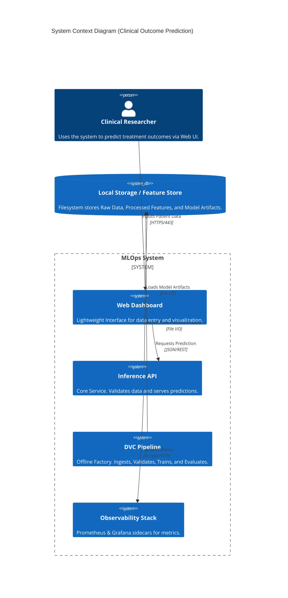
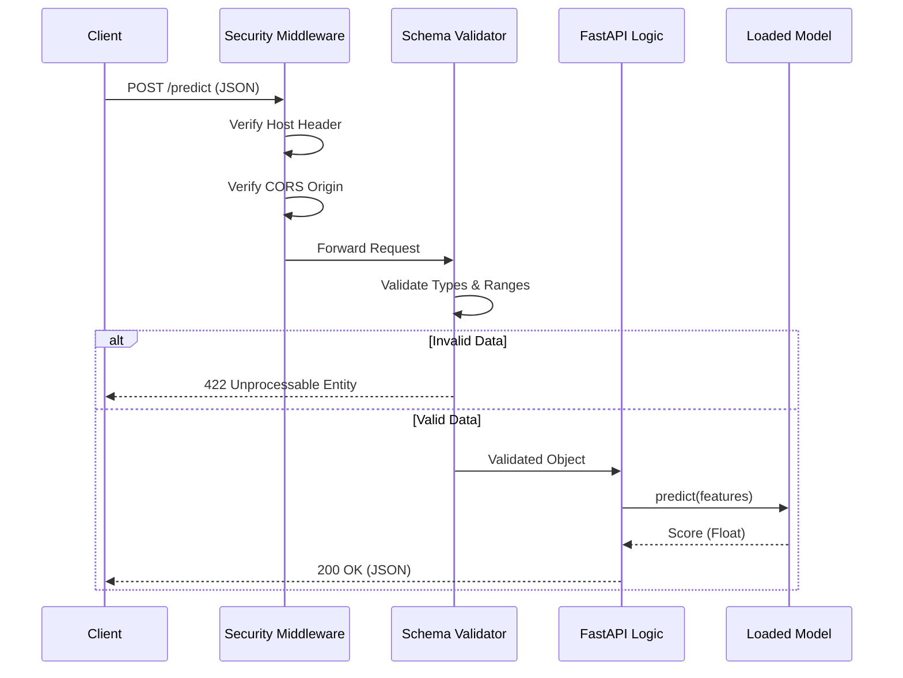

# 🏥 MLOps System: Clinical Treatment Outcome Prediction

<div align="center">


**A production-hardened, zero-trust MLOps system for predicting clinical treatment outcomes.**
*Local Execution Verified. Containerization Provided.*

[Quick Start](#14-development-guide) | [Architecture](#2-system-context--architecture) | [Security](#8-security-architecture)

</div>

---

## 1. Executive Overview

### Purpose

This system provides a robust, reproducible, and secure platform for predicting patient treatment outcomes based on clinical data. It serves as a bridge between experimental data science and production-grade software engineering, ensuring that models are not just "trained" but "engineered" for reliability.

### Business Problem

Clinical research organizations face significant challenges in deploying predictive models:

* **Reproducibility Crisis**: Models trained on individual laptops are often impossible to recreate due to data drift, unversioned code, or random seed variations.
* **Deployment Latency**: Moving a model from a Jupyter Notebook to a production API is a manual, error-prone process that can take weeks.
* **Data Integrity**: "Garbage in, garbage out" leads to silent model failures where invalid clinical data yields medically dangerous predictions.

### Solution

This MLOps system implements a **Zero-Trust** architecture where:

* **Strict Validation**: Data is validated against a rigorous schema (`params.yaml`) at every stage (Ingest -> Train -> Inference).
* **Deterministic Training**: The entire pipeline is version-controlled via DVC, guaranteeing byte-for-byte reproducibility.
* **Hardened Inference**: The model is exposed via a secure FastAPI service with comprehensive observability.

### Architectural Positioning

The system operates as a **Modular Monolith**. It is composed of strictly decoupled components (Pipelines, Training, Inference, Frontend) that reside in a single repository for simplicity but are designed to be split into microservices if scaling demands it.

---

## 2. System Context & Architecture

### System Context Diagram (C4)



### Interactions

* **Clinical Researcher**: End-user initiating the prediction workflow.
* **Inference API**: The central nervous system. It does not store state (Restful) but relies on artifact storage.
* **DVC Pipeline**: The asynchronous "factory" that produces the model artifacts consumed by the API.

### Design Principles

* **Zero-Trust**: Never trust input data. Validate everything.
* **Immutable Artifacts**: Once a model is trained, it is treated as a read-only binary.
* **Infrastructure as Code**: All infrastructure (Docker, K8s, Grafana) is defined declaratively.

---

## 3. Component-Level Design

### Core Modules

| Module | Responsibility | Dependencies | Public Interface |
| :--- | :--- | :--- | :--- |
| `pipelines/` | **Data Factory**. Ingests and transforms data. | `pandas`, `sklearn` | DVC CLI (`dvc repro`) |
| `training/` | **Model Factory**. Trains and evaluates models. | `sklearn`, `joblib` | `train.py`, `evaluate.py` |
| `inference/` | **Service Layer**. Serves predictions. | `fastapi`, `pydantic` | HTTP REST API |
| `validation/` | **Quality Assurance**. Audits the repository. | `subprocess`, `sys` | `make validate` |
| `frontend/` | **Presentation**. Renders the UI. | None (Vanilla JS) | HTTP (Port 8080) |

---

## 4. Data Design

### Schema Structure

The data contract is defined physically in `params.yaml`. This file is the **Single Source of Truth**.

```yaml
schema:
  age_range: [0, 100]
  gender_values: ["Male", "Female"]
  condition_values: ["Diabetes", "Hypertension", ...]
  treatment_duration_range: [1, 365]
```

### Data Objects (DTOs)

* **Raw Data**: CSV format. Potentially dirty.
* **Processed Data**: Parquet/CSV. Cleaned, Validated, Scaled.
* **Model Artifact**: `.joblib`. The serialized Random Forest object.

### Validation Strategy

1. **Ingest**: Check file integrity and basic types.
2. **Validate**: Enforce `params.yaml` constraints (e.g., Age < 100). Fail pipeline if violated.
3. **Inference**: Pydantic models reject invalid JSON payloads before they reach the model.

---

## 5. API Design

### Principles

* **REST**: Resource-oriented URLs (`/predict`, `/health`).
* **JSON API**: Standard request/response format.
* **Stateless**: No session storage on the server.

### Endpoint Specification

| Method | Endpoint | Description | Auth |
| :--- | :--- | :--- | :--- |
| `POST` | `/predict` | Returns prediction score. | Internal |
| `GET` | `/health` | Liveness probe. | Public |
| `GET` | `/metrics` | Prometheus target. | Public |
| `GET` | `/dropdown-values` | Metadata for UI forms. | Public |

---

## 6. Execution Flow

### Prediction Workflow



---

## 7. Infrastructure & Deployment

### Runtime Environment

* **Development**: Docker Compose (Localhost).
* **Production**: Kubernetes (Cluster).

### Containerization Strategy

* **Multi-Stage Builds**: Used to minimize image size.
* **Non-Root Execution**: `USER appuser` enforced in Dockerfiles.
* **Base Image**: `python:3.11-slim` for consistency.

---

## 8. Security Architecture

### Defenses Implemented

* **Input Validation**: Strict *allow-list* validation via Pydantic.
* **Least Privilege**: Processes run as non-root users (`uid=1000`).
* **Network Segregation**: Backend API is not exposed publicly in K8s (ClusterIP only).
* **Secret Management**: Secrets (Grafana Password) injected via Environment Variables.

---

## 9. Performance & Scalability

* **Concurrency**: FastAPI uses `async` for I/O bound operations.
* **Horizontal Scaling**: The API is stateless. It can be scaled to N replicas behind a LoadBalancer.
* **Bottleneck Analysis**: The Random Forest inference is CPU-bound. `n_jobs` is configurable.

---

## 10. Reliability & Fault Tolerance

* **Fail-Fast Startup**: Service crashes immediately if `model.joblib` is missing (Signal to K8s to strictly not route traffic).
* **Health Checks**: `/health` endpoint ensures dependencies are loaded.
* **Graceful Shutdown**: SIGTERM signals are handled to finish in-flight requests.

---

## 11. Observability

### Strategy

"Glass Box" monitoring. We expose internal state, not just black-box up/down status.

### Signals

* **Metrics**: Prometheus (Request Rate, Latency, Error Rate).
* **Logging**: Structured JSON logging (via `logging` module).
* **Tracing**: (Ready for Opentelemetry integration).

---

## 12. Testing Strategy

* **Unit Tests**: `pytest` for individual logic.
* **Integration Tests**: `make validate` runs a full pipeline execution.
* **Contract Tests**: `params.yaml` acts as a contract between Data and Inference.

---

## 13. Configuration

| Env Variable | Default | Description |
| :--- | :--- | :--- |
| `MODEL_PATH` | `models/model.joblib` | Location of the trained model. |
| `GRAFANA_ADMIN_PASSWORD` | `changeme` | Admin password for Grafana. |
| `N_JOBS` | `1` | Number of CPU cores for training. |

---

## 14. Development Guide

### Prerequisites

* Python 3.10+
* Make
* Docker (Optional)

### Quick Start

1. **Setup**: `make setup`
2. **Train**: `make run-pipeline`
3. **Serve**: `make run-api`
4. **UI**: `make run-frontend`

---

## 15. Future Improvements

* **Model Registry**: Integrate MLflow for deeper lineage tracking.
* **Feature Store**: Decouple feature engineering from the training pipeline.
* **Canary Deployments**: Use K8s/Istio for traffic splitting based on `model_version` header.

---
