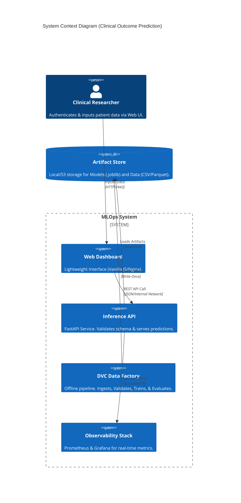

# 🏥 MLOps System: Clinical Treatment Outcome Prediction

<div align="center">


**A production-hardened, zero-trust MLOps system for predicting clinical treatment outcomes.**
*Engineered for Reliability, Reproducibility, and Scalability.*

</div>

---

## 📖 Project Overview

**Clinical Treatment Outcome Prediction Module**

This system predicts the efficacy of pharmaceutical treatments based on patient demographics and clinical history. It is designed for use in regulated healthcare environments, ensuring every prediction is traceable and auditable.

### Key Capabilities

*   **For Clinicians**: A simple web interface to input patient data and get instant predictions.
*   **For Researchers**: A reproducible data pipeline that tracks every version of the dataset and model.
*   **For Engineers**: A fully containerized, microservices-based architecture ready for Kubernetes.

---

## 🚀 Quick Start (Runs in 5 Minutes)

**Prerequisites**: [Docker Desktop](https://www.docker.com/products/docker-desktop/) must be installed and running.

### 1. Start the Application

Open your terminal (Command Prompt or Terminal) and run:

```bash
# Clone the repository
git clone https://github.com/iammohith/MLOps-System-For-Clinical-Treatment-Outcome-Prediction.git
cd MLOps-System-For-Clinical-Treatment-Outcome-Prediction

# Start the full system
docker-compose -f infra/docker/docker-compose.yml up --build -d
```

### 2. Access the System

Once started, the system is available at the following URLs:

*   **Web Interface**: [http://localhost:8080](http://localhost:8080)
*   **Prometheus Metrics**: [http://localhost:9090](http://localhost:9090)
*   **Grafana Dashboards**: [http://localhost:3000](http://localhost:3000) (User: `admin`, Pass: `changeme`)
*   **API**: [http://localhost:8000/docs](http://localhost:8000/docs)

---

## 🖥️ User Interface

The **Clinical Dashboard** allows researchers to input patient variables and receive a predicted improvement score.


### Usage Guide

1.  **Input Data**: Enter Patient Age (18-79), Gender, Condition, Drug, Dosage, and Duration.
2.  **Predict**: Click "Predict Outcome".
3.  **Result**: The system returns a score (0-10) indicating the expected treatment efficacy.

---

## 📊 Monitoring & Observability

The system automatically tracks its own health and performance using industry-standard tools.

### Prometheus Metrics

Raw metric collection for deep-dive analysis by system administrators.


### Grafana Dashboards

Real-time visualization of system health, request rates, and model performance.


---

## 🏗️ Technical Architecture

For engineering teams, the system follows a **Zero-Trust** microservices architecture.

### System Context (C4 Model)



---

## 🛠️ Developer Setup (Python)

If you wish to modify the code or retrain the model, follow these steps.

### Prerequisites

*   Python 3.10+
*   Make

### Installation

```bash
# 1. Setup Virtual Environment
make setup

# 2. Run Data Pipeline (Reproduce Model)
make run-pipeline
# Output: Training complete. Model saved to models/model.joblib
```

### Key Commands

| Command | Description |
| :--- | :--- |
| `make run-pipeline` | Runs the full DVC pipeline (Ingest -> Validate -> Train). |
| `make validate` | Runs the CI/CD quality gates (Code & Data checks). |
| `make clean` | Removes temporary files and artifacts. |

---

## 📂 Project Structure

```
├── data/               # Raw and Processed Datasets (DVC tracked)
├── models/             # Serialized Model Artifacts
├── frontend/           # Web Interface Source Code
├── inference/          # Prediction API Source Code
├── pipelines/          # Data Transformation Scripts
├── training/           # Model Training Logic
├── monitoring/         # Grafana & Prometheus Configs
├── infra/              # Docker & Kubernetes Manifests
└── params.yaml         # Global Configuration
```

---

## ⚖️ Source Data Attribution

The clinical dataset used to train this model is open-source and available on Kaggle:

*   **Name**: [1000 Drugs and Side Effects](https://www.kaggle.com/datasets/palakjain9/1000-drugs-and-side-effects)
*   **License**: Public Domain (CC0)

---

<div align="center">

**Made with ❤️ — Enabling MLOps for Clinical Research**

</div>
