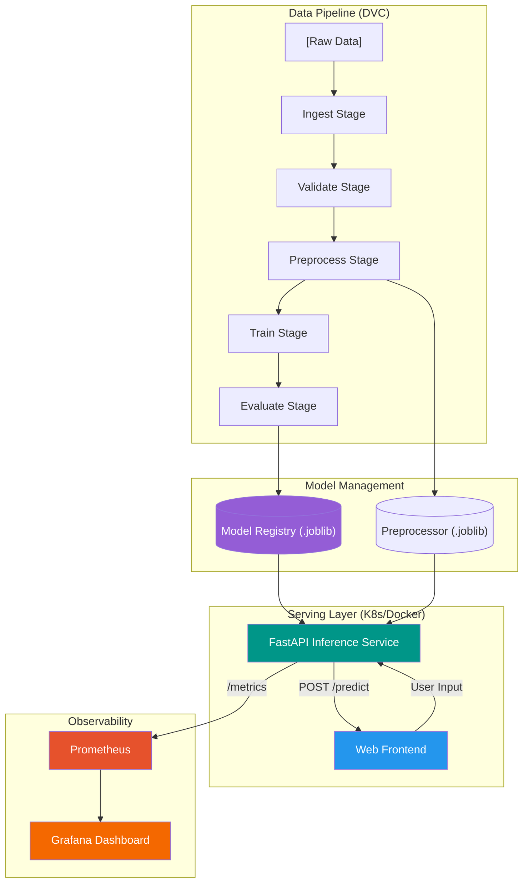

# 🏥 MLOps System: Clinical Treatment Outcome Prediction

<div align="center">


---

**An authoritative AI-clinical integration framework for treatment improvement prediction.**  
Built for high-trust environments where reproducibility and observability are non-negotiable.

[Quick Start](#-quick-setup) • [Architecture](#-high-fidelity-architecture) • [Validation](#-zero-trust-validation) • [Monitoring](#-observability-matrix)

</div>

---

## 📖 System Purpose

This repository implements a production-honest MLOps lifecycle for clinical research. It predicts a patient's **Improvement_Score** (0–10) following treatment, enabling pharmaceutical researchers and clinicians to identify high-efficacy patterns across varying medical contexts.

### 🛡️ Core Guarantees

* **100% Deterministic**: Fixed random seeds and pinned preprocessing transformers ensure identical predictions across all environments.
* **Dynamic Synchronization**: The API validation layer and Web UI are dynamically unified with the lifecycle configuration (`params.yaml`).
* **Fail-Hard Quality**: A Zero-Trust validation protocol prevents the release of broken models or inconsistent manifests.

---

## 🏗️ High-Fidelity Architecture


```mermaid
graph TD
    subgraph "Data Pipeline (DVC)"
        A["[Raw Data]"] --> B["Ingest Stage"]
        B --> C["Validate Stage"]
        C --> D["Preprocess Stage"]
        D --> E["Train Stage"]
        E --> F["Evaluate Stage"]
    end

    subgraph "Model Management"
        F --> G[("Model Registry (.joblib)")]
        D --> H[("Preprocessor (.joblib)")]
    end

    subgraph "Serving Layer (K8s/Docker)"
        G & H --> I["FastAPI Inference Service"]
        I -- "POST /predict" --> J["Web Frontend"]
        J -- "User Input" --> I
    end

    subgraph "Observability"
        I -- "/metrics" --> K["Prometheus"]
        K --> L["Grafana Dashboard"]
    end

    style I fill:#009688,color:#fff
    style J fill:#2496ED,color:#fff
    style K fill:#E6522C,color:#fff
    style L fill:#F46800,color:#fff
    style G fill:#945DD6,color:#fff
```

---

## 🚀 Quick Setup

### ⚡ The Power of Makefile

Skip the manual friction. Our `Makefile` enforces a standardized local environment.

```bash
git clone https://github.com/iammohith/MLOps-System-For-Clinical-Treatment-Outcome-Prediction.git
cd MLOps-System-For-Clinical-Treatment-Outcome-Prediction

# 🏗️ Creates venv, installs optimized deps, and initializes DVC idempotently
make setup

# 🧪 Runs full end-to-end pipeline (Ingest -> Train -> Evaluate)
make run-pipeline

# 🛡️ Performs Zero-Trust Release Validation (API checks, Docker, K8s)
make validate
```

---

## 🛠️ Tech Stack Spotlight

| Component | Technology | Role |
| :--- | :--- | :--- |
| **Lifecycle** | **DVC** | Tracks data versions and pipeline lineage. |
| **Logic Layer** | **Python 3.10+** | High-performance clinical computations. |
| **Inference** | **FastAPI** | High-concurrency serving with async instrumentation. |
| **Validation** | **Pydantic V2** | Dynamic schema enforcement from `params.yaml`. |
| **Containers** | **Docker** | Isolated multi-stage builds for Dev/Stage/Prod. |
| **Monitoring** | **Prometheus** | Real-time SLI collection (Latency, Throughput, Errors). |

---

## 📊 Observability Matrix

Our system provides deep visibility into the inference hot-path.

### Live Targets

1. **Web UI**: `http://localhost:8080` — Clinical dash with glassmorphic design.
2. **API Health**: `http://localhost:8000/health` — Real-time model readiness info.
3. **Prometheus**: `http://localhost:9090` — Target scraping and alerting.
4. **Grafana**: `http://localhost:3000` — Executive p95/p99 latency visualizations.

---

## 🛡️ Zero-Trust Validation

RELEASE AUTHORIZATION is purely binary. We do not accept caveats.

| Check | Tool | Success Criteria |
| :--- | :--- | :--- |
| **Integrity** | `release_check.py` | All 42+ mandatory files present/hash-valid. |
| **Pipeline** | `dvc repro` | Zero diffs between code and model hash. |
| **Docker** | `docker build` | 100% build success for Image Hierarchy. |
| **K8s** | `kubectl dry-run` | Zero manifest syntax or resource violations. |
| **Runtime** | `requests/uvicorn` | 200 OK on `/predict` with verified logic. |

---

## 🚧 Repository Integrity

```text
├── Makefile                     # Root automation engine
├── params.yaml                  # System-wide single source of truth
├── dvc.yaml                     # Pipeline definition
├── inference/                   # FastAPI high-concurrency layer
├── pipelines/                   # Lifecycle stages (Ingest/Preprocess)
├── training/                    # Scikit-learn logic & metrics
├── validation/                  # Release authorization engine
└── infra/                       # Docker & K8s deployment manifests
```

---

## ⚖️ Disclosure & Disclaimer

This software is intended for **Research and Exploratory Analytics** only. It is not an FDA-cleared medical device and should not be used in the direct treatment or diagnosis of clinical patients.
