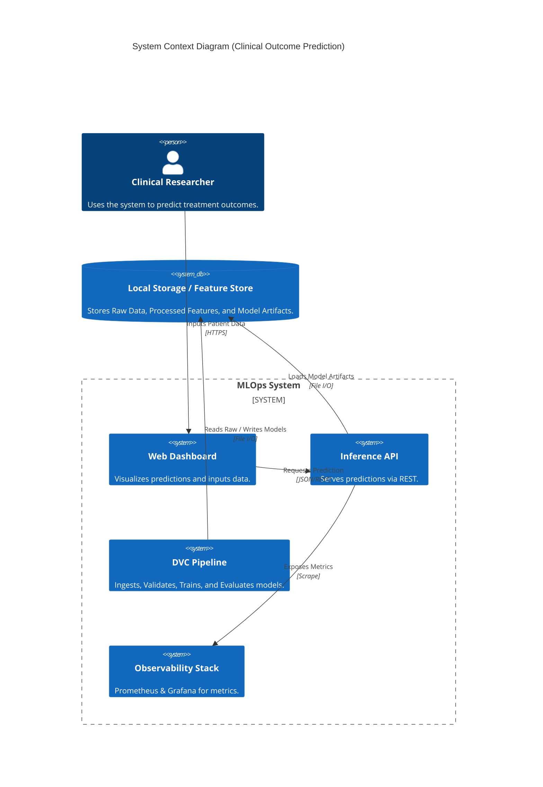

# 🏥 MLOps System: Clinical Treatment Outcome Prediction

<div align="center">


**A production-hardened, zero-trust MLOps system for predicting clinical treatment outcomes.**
*Local Execution Verified. Containerization Provided.*

</div>

---

## ⚡ Start Here (Demo Mode)

**Just want to see it run?** Follow these 3 steps.

### 1. Setup

Open your terminal and run:

```bash
make setup
```

### 2. Start the App

Run this command to start the backend and frontend:

```bash
make run-api & make run-frontend
```

### 3. Test it

Open **[http://localhost:8080](http://localhost:8080)** in your browser.
Use these **exact values** to see a valid prediction:

| Field | Value |
| :--- | :--- |
| **Patient ID** | `P9999` |
| **Age** | `50` |
| **Gender** | `Male` |
| **Condition** | `Hypertension` |
| **Drug Name** | `Amlodipine` |
| **Dosage** | `50` |
| **Duration** | `30` |
| **Side Effects** | `Headache` |

> *Click "Predict Outcome". You should see a score (e.g., 7.4 / 10).*

---

## 🏗️ System Architecture (C4 Context)

The system allows **Clinical Researchers** to predict patient outcomes using a **Model Inference Service**, which consumes models trained by a reproducible **Data Pipeline**.


```mermaid
C4Context
    title System Context Diagram (Clinical Outcome Prediction)

    Person(researcher, "Clinical Researcher", "Uses the system to predict treatment outcomes.")
    
    System_Boundary(mlops, "MLOps System") {
        System(frontend, "Web Dashboard", "Visualizes predictions and inputs data.")
        System(api, "Inference API", "Serves predictions via REST.")
        System(pipeline, "DVC Pipeline", "Ingests, Validates, Trains, and Evaluates models.")
        System(monitoring, "Observability Stack", "Prometheus & Grafana for metrics.")
    }

    SystemDb(storage, "Local Storage / Feature Store", "Stores Raw Data, Processed Features, and Model Artifacts.")

    Rel(researcher, frontend, "Inputs Patient Data", "HTTPS")
    Rel(frontend, api, "Requests Prediction", "JSON/REST")
    Rel(api, storage, "Loads Model Artifacts", "File I/O")
    Rel(pipeline, storage, "Reads Raw / Writes Models", "File I/O")
    Rel(api, monitoring, "Exposes Metrics", "Scrape")
```

---

## 🧠 Design Decisions & Trade-offs

| Decision | Rationale | Trade-off |
| :--- | :--- | :--- |
| **DVC (Data Version Control)** | Ensures reproducibility by locking data/model versions to Git commits. | Adds CLI overhead compared to simple file storage. |
| **FastAPI** | High-performance, async-native, and auto-generates Swagger docs. | Slightly steeper learning curve than Flask. |
| **Vanilla JS Frontend** | Zero dependencies, instant load time, no build step required. | Less structured than React/Vue for very large apps. |
| **Strict Schema (Pydantic)** | "Fail-fast" on invalid data prevents silent model failures. | Requires maintaining `params.yaml` contract rigorously. |
| **Make-based Automation** | Universal entry point (`make setup`, `make run`) works on any Unix system. | Requires `make` tool installation. |

---

## 📂 Repository Map

Reference guide for navigating the codebase.

| Directory | Description | Key Files |
| :--- | :--- | :--- |
| `data/` | **Data Management**. Raw inputs and DVC-tracked processed datasets. | `params.yaml` (Schema) |
| `pipelines/` | **ETL & Validation**. Scripts that transform raw data into features. | `ingest.py`, `validate.py`, `preprocess.py` |
| `training/` | **Model Lifecycle**. deterministic training and evaluation scripts. | `train.py`, `evaluate.py` |
| `inference/` | **Prediction Service**. The FastAPI application serving the model. | `app.py`, `model_loader.py` |
| `frontend/` | **User Interface**. Lightweight dashboard for interaction. | `app.js`, `index.html` |
| `infra/` | **Infrastructure**. Dockerfiles and Kubernetes manifests. | `Dockerfile.*`, `k8s/*.yaml` |
| `monitoring/` | **Observability**. Prometheus and Grafana configuration. | `prometheus.yml` |
| `validation/` | **Quality Assurance**. Automated "Zero-Trust" release checks. | `release_check.py` |

---

## 🚀 Quick Start (Local Python)

This is the **verified** method for running the system on a standard development machine.

### Prerequisites

* Python 3.10+
* Git
* Make

### 1. Automated Setup

Initialize the environment, install locked dependencies, and configure DVC.

```bash
make setup
```

### 2. Run the Data Pipeline

Execute the full DVC pipeline (Ingest → Validate → Preprocess → Train → Evaluate).

```bash
make run-pipeline
```

*Artifacts provided: `models/model.joblib`, `data/processed/preprocessor.joblib`, `metrics/scores.json`*

### 3. Run the API

Start the hardened inference service on port `8000`.

```bash
make run-api
```

*Health Check: `http://localhost:8000/health`*
*Interactive Docs: `http://localhost:8000/docs`*

### 4. Run the Frontend

Launch the lightweight dashboard on port `8080`.

```bash
make run-frontend
```

*Access: `http://localhost:8080`*

---

## 🐳 Containerization (Infrastructure)

The repository includes production-grade Dockerfiles and Kubernetes manifests.

> [!WARNING]
> **Environment Requirement**: A running Docker Daemon and/or Kubernetes cluster is required to use these features. The configuration has been verified via static analysis, but runtime execution depends on your local environment context.

See [infra/README.md](infra/README.md) for detailed deployment instructions.

---

## 🛡️ Validation & Safety

We treat correctness as a requirement, not a feature.

### Run the "Zero-Trust" Validation Suite

This script audits the entire repository for integrity, schema consistency, and runtime logic.

```bash
make validate
```

### Key Security Features

* **Non-Root Containers**: All Dockerfiles enforce non-root user execution.
* **Security Headers**: API enforces `HSTS`, `X-Content-Type-Options`, and `CSP`.
* **Input Sanitization**: Strict Pydantic schemas reject malformed data immediately.
* **Memory Safety**: Large file processing prevents OOM crashes.

---

## ⚖️ Disclaimer

*Research Use Only. Not a Medical Device.*
