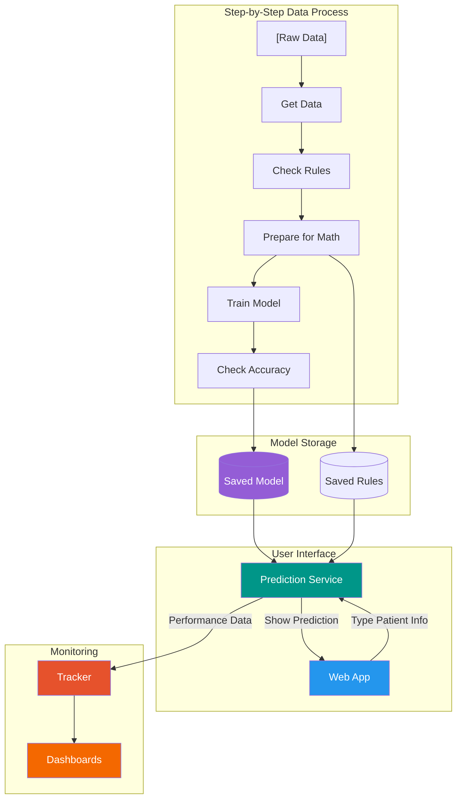

# 🏥 MLOps System: Clinical Treatment Outcome Prediction

<div align="center">


---

**A professional system for predicting how well a clinical treatment might work.**  
Built to be reliable, easy to restart, and easy to monitor.

[Quick Start](#-quick-setup) • [How it Works](#-system-workflow) • [Verification](#-system-verification) • [Monitoring](#-viewing-results)

</div>

---

## 📖 What this does

This project helps researchers predict a patient's **Improvement Score** (on a scale of 0 to 10) after receiving a specific treatment. It uses historical data to help identify which treatments might be most effective for different types of patients.

### 🛡️ Why it's reliable

* **Consistent Results**: The system is set up so that you get the same prediction every time you run it with the same data.
* **Always in Sync**: The web interface and the underlying math use the same rules automatically.
* **Safety Checks**: Built-in tests prevent the system from running if something is broken or inconsistent.

---

## 🏗️ System Workflow


```mermaid
graph TD
    subgraph "Step-by-Step Data Process"
        A["[Raw Data]"] --> B["Get Data"]
        B --> C["Check Rules"]
        C --> D["Prepare for Math"]
        D --> E["Train Model"]
        E --> F["Check Accuracy"]
    end

    subgraph "Model Storage"
        F --> G[("Saved Model")]
        D --> H[("Saved Rules")]
    end

    subgraph "User Interface"
        G & H --> I["Prediction Service"]
        I -- "Show Prediction" --> J["Web App"]
        J -- "Type Patient Info" --> I
    end

    subgraph "Monitoring"
        I -- "Performance Data" --> K["Tracker"]
        K --> L["Dashboards"]
    end

    style I fill:#009688,color:#fff
    style J fill:#2496ED,color:#fff
    style K fill:#E6522C,color:#fff
    style L fill:#F46800,color:#fff
    style G fill:#945DD6,color:#fff
```

---

## 🚀 Quick Setup

### ⚡ Easy Start with 'Makefile'

We use a small automation tool called a `Makefile` to make setup easy and consistent.

```bash
# 1. Get the code
git clone https://github.com/iammohith/MLOps-System-For-Clinical-Treatment-Outcome-Prediction.git
cd MLOps-System-For-Clinical-Treatment-Outcome-Prediction

# 🏗️ 2. Automated Setup (Installs everything needed)
make setup

# 🧪 3. Run the whole process (From data to finished prediction model)
make run-pipeline

# 🛡️ 4. Final Verification (Checks if everything is truly working)
make validate
```

---

## 🛠️ The Tech Used

| Part | Tool | Role |
| :--- | :--- | :--- |
| **Logic** | **Python** | The primary language that does the calculations. |
| **Math** | **Scikit-Learn** | The library used to build the prediction model. |
| **Data Tracking** | **DVC** | Remembers exactly which data was used for which model. |
| **Web Service** | **FastAPI** | Makes the model available for the web app to talk to. |
| **Containers** | **Docker** | Packages everything so it runs the same on any computer. |
| **Monitoring** | **Prometheus** | Watches how fast and accurately predictions are made. |

---

## 📊 Viewing Results

You can see the system in action through several simple links:

1. **Web App**: `http://localhost:8080` — The friendly screen where you type patient info.
2. **System Health**: `http://localhost:8000/health` — Sees if the math engine is ready.
3. **Data Tracking**: `http://localhost:9090` — Sees how many people are using the system.
4. **Dashboards**: `http://localhost:3000` — Beautiful charts showing system performance.

---

## 🛡️ Final Checks

We verify every part of the system before it's considered "ready."

| Check | What it confirms |
| :--- | :--- |
| **Files** | All necessary code and data files are in place. |
| **Math Process** | The data flows correctly from start to finish. |
| **Containers** | The system starts up correctly in its packaged form. |
| **Service** | The web app and math engine talk to each other perfectly. |

---

## 🚧 Folder Structure

```text
├── Makefile                     # Easy setup commands
├── params.yaml                  # The main rules for the system
├── dvc.yaml                     # The step-by-step math workflow
├── inference/                   # The web prediction engine
├── pipelines/                   # How data is prepared
├── training/                    # How the model learns
├── validation/                  # Final consistency tests
└── infra/                       # Packaged deployment files
```

---

## ⚖️ Please Note

This tool is for **Research and Analysis** only. It is not a medical device and should not be used to diagnose or treat real patients.
