# 🏥 MLOps System: Clinical Treatment Outcome Prediction

<div align="center">


**A production-hardened MLOps system for predicting clinical treatment outcomes.**


</div>

---

## Quick Start

> One command deploys the entire stack: API, Frontend, Prometheus, and Grafana.

```bash
# 1. Clone the repository
git clone https://github.com/iammohith/MLOps-System-For-Clinical-Treatment-Outcome-Prediction.git
cd MLOps-System-For-Clinical-Treatment-Outcome-Prediction

# 2. Train the model & generate data artifacts (Requires Python 3.10+ and Make)
make setup
make run-pipeline

# 3. Deploy the full 4-container system
docker-compose -f infra/docker/docker-compose.yml up --build -d
```

### System Access Points

| Service | URL | Description |
| :--- | :--- | :--- |
| **Clinical Dashboard** | [http://localhost:8080](http://localhost:8080) | Web UI for patient data input and prediction visualization |
| **Inference API Docs** | [http://localhost:8000/docs](http://localhost:8000/docs) | Interactive Swagger/OpenAPI specification |
| **Grafana Dashboards** | [http://localhost:3000](http://localhost:3000) | Live performance metrics (Login: `admin` / `changeme`) |
| **Prometheus Targets** | [http://localhost:9090](http://localhost:9090) | Raw time-series metric database and scrape status |

### Tear-Down

```bash
docker-compose -f infra/docker/docker-compose.yml down --remove-orphans
```

---

## 1. Executive Overview

### Purpose

The Clinical Treatment Outcome Prediction system is a production-grade MLOps platform. It predicts the efficacy of pharmaceutical treatments based on patient demographics, medical history, and prescribed regimens, outputting an `Improvement_Score` (0–10 scale).

### Business Problem

Clinicians and clinical researchers need data-backed heuristics to estimate how well a patient will respond to a specific drug, dosage, and treatment duration before administering the regimen.

### Technical Problem

ML models degrade silently in production. This system addresses this through:
- **Strict data contracts** enforced by `params.yaml` as a single source of truth
- **Reproducible pipelines** via DVC (Data Version Control)
- **Containerized serving** with non-root Docker images
- **Real-time observability** via Prometheus metrics and Grafana dashboards

### Dataset Source

The model is trained on the [1000 drugs and side-effects dataset](https://www.kaggle.com/datasets/palakjain9/1000-drugs-and-side-effects) available on Kaggle.

---

## 2. System Context & Architecture

### System Context Diagram

```mermaid
C4Context
    title System Context Diagram

    Person(researcher, "Clinical Researcher", "Inputs patient data via Web UI")
    
    System_Boundary(mlops, "MLOps System") {
        System(frontend, "Web Dashboard", "Vanilla JS SPA served by Nginx")
        System(api, "Inference API", "FastAPI — validates input & serves predictions")
        System(pipeline, "DVC Data Factory", "Offline pipeline: Ingest → Validate → Train → Evaluate")
        System(monitoring, "Observability Stack", "Prometheus & Grafana for real-time metrics")
    }

    SystemDb(storage, "Artifact Store", "Local storage for models (.joblib) and data")

    Rel(researcher, frontend, "HTTPS")
    Rel(frontend, api, "REST API", "JSON via Nginx reverse proxy")
    Rel(api, storage, "Reads artifacts")
    Rel(pipeline, storage, "Writes artifacts")
    Rel(api, monitoring, "Exposes /metrics")
```



### Architectural Style

- **Microservices Deployment**: Decomposed into independently deployable containers (API, Frontend, Monitoring sidecars)
- **Pipeline-as-Code (DAG)**: Training is managed via a Directed Acyclic Graph codified in `dvc.yaml`
- **Zero-Trust Input Validation**: Deep integration between `params.yaml` (schema truth), `valid_combinations.json` (clinical constraints), and `schemas.py` (Pydantic enforcement)

### Key Architectural Decisions

| Decision | Rationale |
| :--- | :--- |
| Random Forest over Neural Networks | Tree-based models provide interpretable feature importances critical for medical contexts |
| Pydantic over manual validation | Compile-time type safety with automatic OpenAPI schema generation |
| Vanilla JS over React/Angular | Zero npm dependencies, < 20KB total, eliminates supply-chain attack surface |
| DVC over MLflow for pipelines | Tight Git integration, file-hash-based caching, no external server dependency |

---

## 3. Component-Level Design

### Repository Structure

```text
├── inference/          # FastAPI prediction service
│   ├── app.py          #   HTTP routing, middleware, Prometheus instrumentation
│   ├── model_loader.py #   Singleton model/preprocessor loader
│   └── schemas.py      #   Pydantic request/response validation
├── frontend/           # Vanilla JS clinical dashboard
│   ├── index.html      #   Semantic HTML structure
│   ├── app.js          #   API integration and DOM manipulation
│   └── styles.css      #   CSS custom properties design system
├── pipelines/          # Offline DVC pipeline stages
│   ├── ingest.py       #   Raw data extraction
│   ├── validate.py     #   Schema enforcement against params.yaml
│   ├── preprocess.py   #   Feature scaling, encoding, train/test split
│   └── extract_combinations.py  # Generates valid_combinations.json
├── training/           # Model training and evaluation
│   ├── train.py        #   RandomForestRegressor fitting
│   ├── evaluate.py     #   RMSE, MAE, R² computation
│   └── tune.py         #   GridSearchCV hyperparameter optimization
├── validation/         # Release quality gates
│   └── release_check.py  # 5-step automated verification
├── infra/              # Infrastructure as Code
│   ├── docker/         #   Dockerfiles, docker-compose.yml, nginx.conf
│   └── k8s/            #   Kubernetes manifests (namespace, deployments, services)
├── monitoring/         # Observability stack configuration
│   ├── prometheus.yml  #   Scrape configuration
│   └── grafana/        #   Provisioning and dashboard JSON
├── tests/              # Pytest test suite
├── data/               # Raw and processed data (DVC-managed)
├── models/             # Serialized model artifacts (DVC-managed)
├── metrics/            # Evaluation scores (scores.json)
├── params.yaml         # Central configuration (single source of truth)
└── dvc.yaml            # Pipeline DAG definition
```

### Module Documentation

Each subdirectory contains a detailed README following a consistent architectural standard:

| Module | README | Responsibility |
| :--- | :--- | :--- |
| **Data** | [data/README.md](data/README.md) | Schema contracts, DVC tracking, data lifecycle |
| **Pipelines** | [pipelines/README.md](pipelines/README.md) | DAG execution (Ingest → Validate → Preprocess → Train) |
| **Training** | [training/README.md](training/README.md) | Random Forest training, evaluation, hyperparameter tuning |
| **Models** | [models/README.md](models/README.md) | Artifact versioning, serialization, compatibility matrix |
| **Metrics** | [metrics/README.md](metrics/README.md) | Performance KPIs (RMSE, MAE, R²) |
| **Inference** | [inference/README.md](inference/README.md) | FastAPI service, endpoints, schema validation |
| **Frontend** | [frontend/README.md](frontend/README.md) | Web UI, DOM logic, CSS design system |
| **Infrastructure** | [infra/README.md](infra/README.md) | Docker, Kubernetes, network topology |
| **Monitoring** | [monitoring/README.md](monitoring/README.md) | Prometheus & Grafana stack |
| **Validation** | [validation/README.md](validation/README.md) | CI/CD gates, release checklists |
| **Tests** | [tests/README.md](tests/README.md) | Automated unit and integration testing boundaries |

---

## 4. Data Design

### Schema Structure

The core domain entity is the **Patient Treatment Event**, defined in `params.yaml`:

```mermaid
erDiagram
    TREATMENT_EVENT {
        string Patient_ID "Pseudonymized identifier"
        int Age "18–79"
        string Gender "Female | Male"
        string Condition "Depression | Diabetes | Hypertension | Infection | Pain Relief"
        string Drug_Name "15 drugs (Metformin, Losartan, ...)"
        float Dosage_mg "50 | 100 | 250 | 500 | 850"
        int Treatment_Duration_days "5–59"
        string Side_Effects "30 categories"
        float Improvement_Score "Target: 0.0–10.0"
    }
```



### Validation Strategy

| Layer | Mechanism | Scope |
| :--- | :--- | :--- |
| **Pipeline** | `validate.py` checks bounds/enums against `params.yaml` | Training data integrity |
| **API** | Pydantic `field_validator` + `model_validator` | Runtime input validation |
| **Frontend** | `validateCombination()` against `valid_combinations.json` | Client-side UX guard |

---

## 5. API Design

The Inference API follows REST principles, enforced by FastAPI.

| Endpoint | Method | Description | Response |
| :--- | :--- | :--- | :--- |
| `/health` | `GET` | Liveness/readiness probe | `{"status": "healthy", "model_loaded": true, "model_version": "v-..."}` |
| `/predict` | `POST` | Core inference | `{"Patient_ID": "...", "Improvement_Score": 7.27, "model_version": "v-..."}` |
| `/dropdown-values` | `GET` | Schema enums for frontend | `{"genders": [...], "conditions": [...], "drugs": [...], ...}` |
| `/metrics` | `GET` | Prometheus scrape target | Prometheus text format |

### Error Handling

- **HTTP 422**: Schema validation failure with detailed JSON context (invalid enums, out-of-range values, unrecorded drug-condition combinations)
- **HTTP 503**: Model not loaded (startup in progress or load failure)
- **HTTP 500**: Unhandled internal error (sanitized — no stack traces leak to client)

---

## 6. Execution Flow

### Inference Request Sequence

```mermaid
sequenceDiagram
    participant User
    participant Frontend
    participant Nginx
    participant API
    participant Pydantic
    participant ModelLoader
    participant Prometheus

    User->>Frontend: Fills form & clicks Predict
    Frontend->>Frontend: validateCombination() — client guard
    Frontend->>Nginx: POST /api/predict
    Nginx->>API: POST /predict (reverse proxy rewrite)
    API->>Pydantic: Validate JSON payload
    Pydantic->>Pydantic: Enums, ranges, scientific combinations
    Pydantic-->>API: Validated PredictionRequest
    API->>ModelLoader: dict(features)
    ModelLoader->>ModelLoader: preprocessor.transform() → model.predict()
    ModelLoader-->>API: Clamped float (0–10)
    API->>Prometheus: Increment counters, observe latency
    API-->>Nginx: HTTP 200 JSON
    Nginx-->>Frontend: Response
    Frontend-->>User: Animated score gauge
```



### Pipeline DAG Execution


---

## 7. Infrastructure & Deployment

### Docker Compose Topology

| Container | Image | Port | Role |
| :--- | :--- | :--- | :--- |
| `mlops-inference-api` | `python:3.11-slim` (multi-stage) | `8000` | FastAPI prediction engine |
| `mlops-frontend` | `nginx:1.25-alpine` | `8080` | Static SPA + reverse proxy to API |
| `mlops-prometheus` | `prom/prometheus:v2.49.1` | `9090` | Time-series metric collector |
| `mlops-grafana` | `grafana/grafana:10.3.1` | `3000` | Dashboard visualization |

### Network Architecture

All containers communicate on an isolated Docker bridge network (`mlops-network`). The frontend's Nginx reverse proxy rewrites `/api/*` → `http://inference-api:8000/*`, eliminating CORS in production.

### Kubernetes (Production)

K8s manifests in `infra/k8s/` define Deployments, Services, and a dedicated `mlops-system` Namespace. Apply via:

```bash
kubectl apply -f infra/k8s/
```

### Health Checks

- **Inference API**: `HEALTHCHECK` every 30s via internal Python HTTP request to `/health`
- **Frontend**: `HEALTHCHECK` every 30s via `wget --spider http://localhost:8080/`
- **Docker Compose**: `restart: unless-stopped` on all services

---

## 8. Security Architecture

| Layer | Mechanism |
| :--- | :--- |
| **Container Isolation** | Non-root users (`appuser`, `nginx`) in all Dockerfiles |
| **CORS** | `ALLOWED_ORIGINS` env var; `allow_credentials` disabled for wildcard origins |
| **CSP Headers** | `default-src 'self'`; inline scripts/styles allowed only for Swagger UI |
| **Trusted Hosts** | `TrustedHostMiddleware` blocks HTTP Host header spoofing |
| **Input Validation** | Pydantic re-validates all payloads server-side (client validation is untrusted) |
| **Prometheus DoS** | Metric labels use matched route paths, not raw URLs, preventing high-cardinality OOM |
| **Data Privacy** | No PII ingested; `Patient_ID` is pseudonymized (`P0001`-style) |
| **Grafana Auth** | Basic auth with configurable `GF_SECURITY_ADMIN_PASSWORD` |

---

## 9. Performance & Scalability

- **API Concurrency**: Uvicorn ASGI server, async request handling
- **Model Loading**: Singleton pattern — loaded once at startup via `lifespan`, zero disk I/O during inference
- **Prediction Latency**: Sub-millisecond (Random Forest `.predict()` releases GIL for C-level matrix operations)
- **Frontend Bundle**: < 20KB total (HTML + CSS + JS), loads instantly on constrained networks
- **Horizontal Scaling**: API is stateless — scale via `replicas` in K8s or Docker Compose `--scale`

---

## 10. Reliability & Fault Tolerance

- **Graceful Startup**: If model loading fails, the API starts but reports `model_loaded: false` via `/health`, allowing orchestrators to detect unavailability without crash loops
- **Input Guardrails**: Invalid inputs are caught by Pydantic before reaching Scikit-Learn, preventing NaN/ValueError crashes during C-level execution
- **Pipeline Fail-Fast**: Any validation failure in `validate.py` exits with non-zero code, halting the DVC DAG immediately
- **API Error Boundary**: Global `@app.exception_handler(Exception)` prevents raw stack traces from leaking to clients
- **Subprocess Timeouts**: `release_check.py` enforces 600s timeout on all subprocess calls to prevent indefinite hangs

---

## 11. Observability

### Prometheus Metrics (Exposed via `/metrics`)

| Metric | Type | Description |
| :--- | :--- | :--- |
| `api_request_total` | Counter | Total requests by method, endpoint, status |
| `api_prediction_total` | Counter | Total prediction requests served |
| `api_request_duration_seconds` | Histogram | Request latency distribution |
| `api_prediction_errors_total` | Counter | Failed prediction attempts |
| `model_info` | Gauge | Current model version hash |

### Grafana Dashboard

The **Clinical Prediction API Dashboard** is auto-provisioned on startup via provisioning-as-code. It includes 8 panels:

- API Request Rate (time-series)
- Request Latency P50/P95/P99 (time-series)
- Total Predictions (stat)
- Prediction Errors (stat)
- Error Rate (time-series)
- API Health Status (UP/DOWN indicator)
- Model Version (stat)
- Request Volume 24h (bar gauge)

#### Live Metrics Preview


### Logging

- **API**: Request logging middleware outputs method, path, status code, and duration for every request
- **Pipeline**: Each DVC stage logs to stdout with structured messages

---

## 12. Testing Strategy

### Test Suite

```bash
# Run all tests
make test

# Or directly via pytest
pytest tests/ -v
```

| Test File | Coverage |
| :--- | :--- |
| `test_inference.py` | Health endpoint, metrics, valid/invalid predictions, dropdown values |
| `test_pipelines.py` | Schema validation logic, preprocessor construction |
| `test_training.py` | Model instantiation, fit/predict on toy data |

### Integration Testing

- **`make validate`**: Runs the full release validation script (`release_check.py`), which:
  1. Checks repository integrity (mandatory files, YAML syntax)
  2. Executes the DVC pipeline end-to-end
  3. Builds all Docker images
  4. Validates K8s manifests via `kubectl dry-run`
  5. Starts the API, hits `/health`, `/predict`, and `/metrics`

---

## 13. Configuration & Environment Variables

| Variable | Service | Default | Description |
| :--- | :--- | :--- | :--- |
| `MODEL_PATH` | Inference API | `models/model.joblib` | Path to serialized Random Forest model |
| `PREPROCESSOR_PATH` | Inference API | `data/processed/preprocessor.joblib` | Path to Scikit-Learn transformer pipeline |
| `ALLOWED_ORIGINS` | Inference API | `http://localhost:8080,...` | Comma-separated CORS origins |
| `ALLOWED_HOSTS` | Inference API | `localhost,127.0.0.1` | Trusted hosts for `TrustedHostMiddleware` |
| `N_JOBS` | Training | (auto) | CPU cores for parallel training (`-1` = all) |
| `GF_SECURITY_ADMIN_PASSWORD` | Grafana | `changeme` | Dashboard admin password |

### Central Configuration

All pipeline parameters, schema bounds, feature definitions, and model hyperparameters are defined in [`params.yaml`](params.yaml). This is the **single source of truth** consumed by pipelines, training, and inference.

---

## 14. Development Guide

### Prerequisites

- Python 3.10+
- Docker & Docker Compose
- `make` (GNU Make)

### Local Setup (Without Docker)

```bash
# 1. Create virtual environment and install dependencies
make setup

# 2. Run the DVC pipeline (train the model)
make run-pipeline

# 3. Start the API server (with hot reload)
make run-api

# 4. Start the frontend (separate terminal)
make run-frontend
```

### Running Tests

```bash
make test
```

### Full Release Validation

```bash
make validate
```

### Extending the Schema

1. Update `params.yaml` with new values/ranges
2. Run `make run-pipeline` to propagate validations
3. Run `python pipelines/extract_combinations.py` to regenerate constraints
4. Update `schemas.py` if new fields are added

---

## 15. Future Improvements

| Area | Improvement |
| :--- | :--- |
| **Scalability** | Migrate model artifacts from local filesystem to S3/GCS registry |
| **Orchestration** | Replace DVC with Airflow/Prefect for distributed DAG execution |
| **Format** | Shift from CSV to Parquet for compressed columnar storage |
| **Testing** | Expand pytest coverage for edge-case inference scenarios |
| **Frontend** | Add Playwright/Cypress E2E tests in CI |
| **Security** | Integrate `trivy` container scanning in release validation |
| **Model Registry** | Adopt MLflow for experiment tracking and Champion/Challenger deployments |
| **Alerting** | Wire Prometheus to Alertmanager → PagerDuty/Slack for SLO violations |

---

## 16. Contributing & Community

Contributions are welcome! Please see our:
- [🤝 Contributing Guidelines](CONTRIBUTING.md)
- [⚖️ Code of Conduct](CODE_OF_CONDUCT.md)

### License

This project is licensed under the MIT License — see the [LICENSE](LICENSE) file for details.

---

<div align="center">

**Made with ❤️ for the MLOps Community & Clinical Researchers**

[⬆ Back to Top](#-mlops-system-clinical-treatment-outcome-prediction)

</div>
