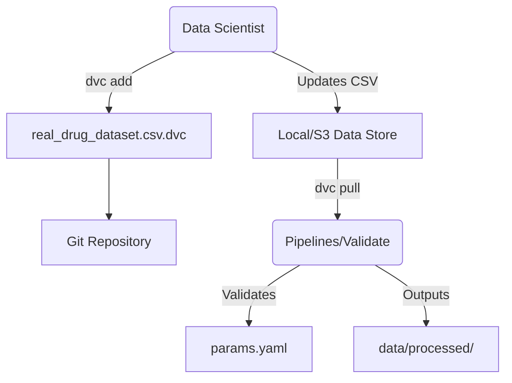
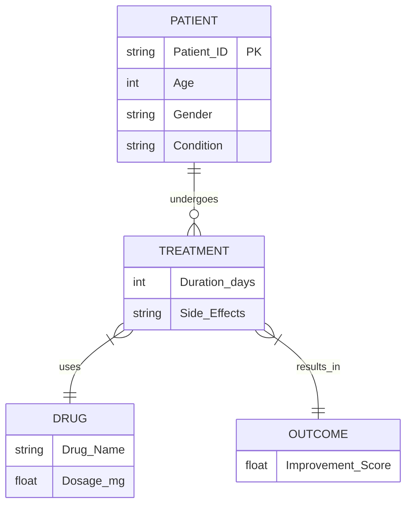

# Data Management & Schema Contracts

<div align="center">


**The foundation of the MLOps pipeline. Strictly typed, versioned, and immutable.**

[⬅️ Back to Root](../README.md)

</div>

---

## 1. Executive Overview

### Purpose
The `data/` module manages the lifecycle, versioning, and validation of the clinical dataset utilized across the MLOps pipelines.

### Business & Technical Problems Solved
- **Business**: Ensures models are trained on clinically accurate constraints, preventing potentially life-threatening prediction errors.
- **Technical**: Implements "Data as Code", effectively versioning massive datasets alongside logic while maintaining GDPR/HIPAA compliance through pseudonymization. Solves data drift ("Age" moving from years to months) via hard schema boundaries.

### Role Within the System
Data is the foundational dependency. The pipeline requires cryptographically hashed data pointers (`.dvc`) before proceeding to the ingestion and training phases.

### High-Level Instructions
Never commit unversioned CSVs to Git. Manage raw datasets as follows:
```bash
dvc add data/raw/real_drug_dataset.csv
git add data/raw/real_drug_dataset.csv.dvc
git commit -m "chore(data): updated Q1 2026 Batch"
dvc push
```

### 📂 Directory Details

This directory contains the data pipelines and intermediate artifacts used for model training and evaluation.

#### Dataset Source
The raw data comes from the [1000 drugs and side-effects dataset](https://www.kaggle.com/datasets/palakjain9/1000-drugs-and-side-effects) available on Kaggle.

#### Structure

- `raw/`: Unprocessed data ingested from upstream environments.
- `processed/`: Features, labels, and preprocessor outputs post-pipeline execution.

---

## 2. System Context & Architecture

### Data Provenance Context
The data module interfaces primarily with the DVC registry and the pipeline validator.



### Architectural Principles
- **Immutability**: Once ingested and hashed by DVC, a dataset version cannot be silently altered.
- **Contract-Driven**: All data parsing logic is driven by definitions in `params.yaml`, ensuring a single source of truth for schema bounds.

---

## 3. Component-Level Design

### Core Directories

1. **`data/raw/`**
   - **Responsibility**: Holds original data assets.
   - **Dependencies**: `dvc`.
   - **Interfaces**: Contains pointers (e.g., `real_drug_dataset.csv.dvc`) and strict `.gitignore` rules preventing `.csv` inclusions.

2. **`data/processed/`**
   - **Responsibility**: Holds output artifacts post-pipeline execution.
   - **Dependencies**: Pipelines logic.
   - **Contents**: 
     - `validated.csv` (Schema-compliant)
     - `X_train.csv`, `X_test.csv` (Features)
     - `y_train.csv`, `y_test.csv` (Labels)
     - `preprocessor.joblib` (Scikit-Learn Pipeline)
     - `valid_combinations.json` (Used by inference for constraints)

---

## 4. Data Design

### Schema Structure (params.yaml)

| Column Name | Type | Valid Range / Values | Description |
| :--- | :--- | :--- | :--- |
| `Patient_ID` | String | Format: `P\d+` | Unique identifier (Pseudonymized). |
| `Age` | Int | `18` - `79` | Patient age in years. |
| `Gender` | Enum | `Male`, `Female` | Biological sex. |
| `Condition` | Enum | `Diabetes`, `Hypertension`... | Primary diagnosis code (ICD-10 equivalent). |
| `Drug_Name` | Enum | `Metformin`, `Losartan`... | Prescribed medication. |
| `Dosage_mg` | Float | Enums `50.0` - `850.0` | Daily dosage amount. |
| `Treatment_Duration` | Int | `5` - `59` | Length of prescribed course. |
| `Side_Effects` | Enum | `Nausea`, `Dizziness`... | Reported adverse events. |
| `Improvement_Score` | Float | `0.0` - `10.0` | Target: Clinical outcome metric. |

### Relationships (Entity Model)



---

## 5. Execution Flow
Detailed in [pipelines/README.md](../pipelines/README.md)

---

## 6. Security Architecture

- **Data Privacy**: The pipeline expects strict pseudonymization (`P0001` vs "John Doe"). Full PII stripping must occur upstream prior to hitting this operational datastore.
- **Data Protection**: 
  - **At Rest**: Relies on underlying volume encryption or Cloud Provider storage encryption (e.g., AWS KMS for S3).
  - **In Transit**: Handled securely via `https` when fetching via DVC CLI.

---

## 7. Performance & Scalability

- **Storage Optimization**: File deduplication operates locally via DVC's `.dvc/cache` mapping.
- **Large Dataset Streaming**: As datasets scale, Pandas `.read_csv` should be replaced with PyArrow/Polars or lazy-loading iterators to maintain reasonable memory overhead during extraction processing.

---

## 8. Reliability & Fault Tolerance
- **Data Consistency**: Missing `.dvc` references instantly crash pipeline reproduction, deliberately preventing "dirty state" execution using cached stale data.

---

## 9. Observability
- **Tracking Changes**: Execute `dvc metrics diff` alongside `git diff` during PR reviews to verify if a feature distribution shifted considerably.

---

## 10. Testing Strategy
- **Contract Testing**: Data validation via `pipelines/validate.py` strictly drops or halts rows failing `params.yaml` criteria. Ensure tests inject intentionally broken data to verify circuit breakers.

---

## 11. Development Guide

### Fetching Data
If cloning fresh, run the following to sync localized data:
```bash
dvc pull
```

### Debugging Integrity Issues
- `ValidationError: Age out of range`: Check raw upstream source for pediatric inclusion which is out-of-bounds.
- `No data error`: The DVC layer is broken or out of sync with Git `git status`.

---

## 12. Future Improvements
- **Format Upgrades**: Shift from `.csv` to `.parquet` to preserve nested types, shrink storage sizes, and accelerate column-wise aggregations.
- **Feature Store Integration**: Decouple static data tracking via robust Feast or Hopsworks infrastructure for dynamic real-time feature retrieval.
