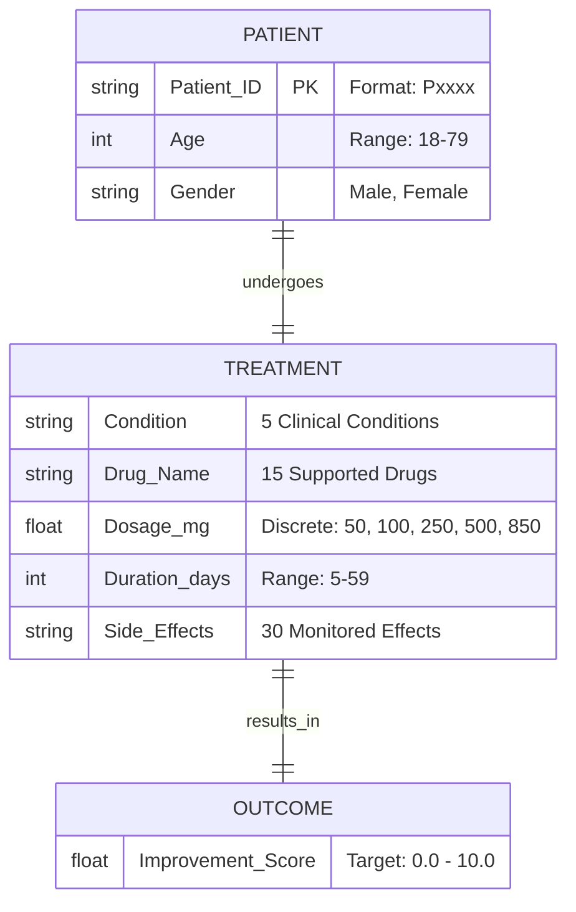

# 🗄️ Data Management

<div align="center">


**Data versioning and strict schema enforcement.**
*Verified for local execution.*

[⬅️ Back to Root](../README.md)

</div>

---

## 📐 Data Relationships (ERD)

The data schema is flat but strictly typed to ensure clinical validity.



---

## 🧠 Design Decisions

| Decision | Rationale |
| :--- | :--- |
| **Constraints in `params.yaml`** | Single Source of Truth (SSOT). Both Python backend and JS frontend read this file to validate inputs. |
| **Discrete Dosages** | Medical dosages are not continuous (you can't take 53mg). We treat them as categorical floating-point values. |
| **Strict Typing** | `Age` must be Integer. `Duration` must be Integer. This prevents "floating point age" errors. |
| **Read-Only Raw Data** | The `data/raw` folder is treated as immutable. Any cleaning creates a *new* file in `data/processed`. |

---

## 📋 Data Schema

All data flowing through the system is validated against the central contract in `params.yaml`.

### Numeric Constraints

| Feature | Range | Type |
| :--- | :--- | :--- |
| `Age` | **18 – 79** | Integer |
| `Dosage_mg` | [50, 100, 250, 500, 850] | Float (Discrete) |
| `Treatment_Duration_days` | **5 – 59** | Integer |
| `Improvement_Score` | 0 – 10 | Float (Target) |

### Categorical Feature

* **Gender**: `Female`, `Male`
* **Condition**: 5 distinct clinical conditions.
* **Drug_Name**: 15 supported medications.
* **Side_Effects**: 30 monitored side effects.

> [!WARNING]
> **Strict Enforcement**: Data outside these ranges will cause pipeline failures (Validation Stage) or API Errors (422 Unprocessable Entity).

---

## 🔄 Lifecycle & Commands

1. **Raw Data**: Stored in `data/raw/` (Read-Only source).
2. **Processed**: Generated in `data/processed/` (Git-ignored, DVC-tracked).
3. **Versioning**: Use `dvc` commands to manage data history.

```bash
# Check if data is up to date vs dvc.lock
dvc status

# Pull latest data from remote (if configured)
dvc pull

# Commit changes to data
dvc commit
```

---

## 📁 Directory Manifest

| File | Description |
| :--- | :--- |
| `raw/real_drug_dataset.csv` | The immutable source dataset. |
| `processed/ingested.csv` | Output of Ingest stage (validated copy). |
| `processed/clean_data.csv` | Output of Validation stage (schema compliant). |
| `processed/X_train.csv` | Preprocessed features (One-Hot Encoded, Scaled). |
| `processed/y_train.csv` | Target labels. |
| `processed/preprocessor.joblib` | Saved Scikit-Learn pipeline (Scaler/Encoder) for inference. |

---

## ❓ Troubleshooting

| Issue | Cause | Fix |
| :--- | :--- | :--- |
| **MD5 Mismatch** | `dvc.lock` doesn't match actual file hash. | Run `dvc repro` to regenerate the file and update the lock. |
| **Missing Data** | You cloned the repo but didn't pull data. | Run `dvc pull` (if remote setup) or `dvc repro` to regenerate from raw. |
