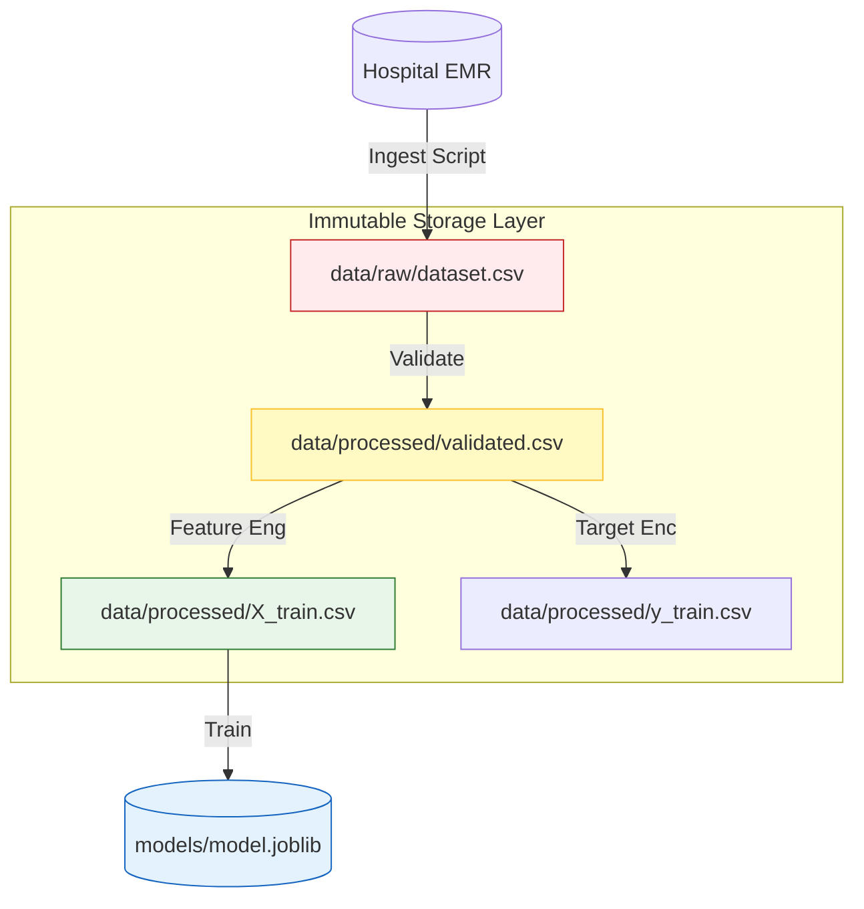
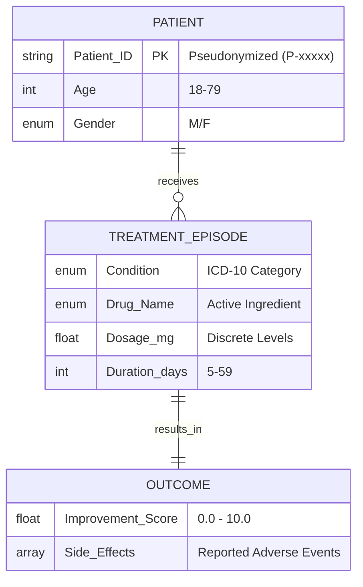
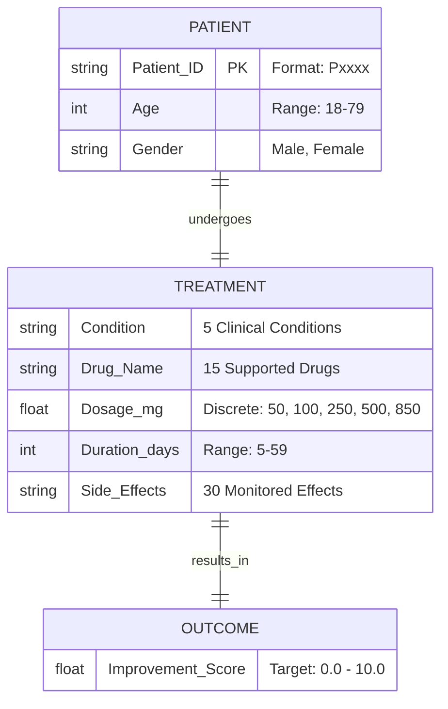

# 🗄️ Data Engineering & Management

<div align="center">


**A rigorous system for versioning, validating, and transforming clinical datasets.**
*Immutable. Traceable. Compliant.*

[⬅️ Back to Root](../README.md)

</div>

---

## 1. Executive Overview

### Purpose

The Data Layer is the foundation of the MLOps system. It manages the lifecycle of clinical data from raw ingestion to feature engineered artifacts. It enforces **Schema Contracts** and ensuring **Reproducibility**.

### Business Problem

* **Data Drifts**: Upstream changes in hospital EMR formats break downstream models.
* **Compliance Risks**: Storing PII/PHI in insecure formats violates HIPAA/GDPR.
* **Silent Corruption**: "Bit Rot" or accidental manual edits to CSVs invalidate weeks of training.

### Solution

* **Immutable Lake**: Raw data is read-only. We never modify source files; we only create new versioned artifacts.
* **Contract-First Design**: The `params.yaml` file acts as a legal contract. Data that violates it is rejected at the gate.
* **Content-Addressable Storage**: DVC hashes file contents. If a single byte changes, the hash changes, alerting the system.

### Architectural Positioning

This module is the **Foundation Layer**. It feeds the Pipeline (`pipelines/`) and is governed by the Configuration (`params.yaml`).

---

## 2. System Context & Data Flow

### The "Data Factory" Architecture



### Interactions

1. **Ingestion**: `pipelines/ingest.py` pulls from source.
2. **Validation**: `pipelines/validate.py` checks schema against `params.yaml`.
3. **Transformation**: `pipelines/preprocess.py` scales and encodes features.

---

## 3. Data Schema & Relationships (ERD)

The data schema is flat to optimize for columnar processing, but represents complex clinical entities.



### Constraints (Enforced via `params.yaml`)

| Field | Type | Constraint | Rationale |
| :--- | :--- | :--- | :--- |
| `Age` | Int | `18-79` | Clinical trial protocol inclusion criteria. |
| `Dosage_mg` | Float | `[50, 100, ..., 850]` | Standard pill sizes. Continuous values indicate data error. |
| `Side_Effects` | String | List of 30 known terms | Standardization for NLP downstream. |

---

## 4. Storage & Directory Structure

We adhere to a **Tiered Storage** strategy.

| Tier | Directory | State | Policy |
| :--- | :--- | :--- | :--- |
| **Bronze** | `data/raw/` | Immutable | Original dump. Never edited. Git-Ignored (DVC Tracked). |
| **Silver** | `data/processed/` | Transient | Cleaned, Validated. Can be deleted and regenerated. |
| **Gold** | `models/` | Valuable | The final intelligence artifact. |

**Directory Manifest**:

* `real_drug_dataset.csv`: The 1000-row synthetic ground truth.
* `preprocessor.joblib`: The Scikit-Learn `ColumnTransformer` (Scaling/Encoding logic) needed for inference.
* `X_train.csv` / `y_train.csv`: Split and prepared matrices for training loop.

---

## 5. Versioning Strategy (DVC)

We do not track large files in Git. We track **Metadata**.

* **.dvc files**: Small text pointers containing MD5 hashes and cloud storage paths (S3/GCS).
* **dvc.lock**: The exact snapshot of the data pipeline state.

### Common Operations

| Goal | Command |
| :--- | :--- |
| **View Changes** | `dvc status` |
| **Reproduce Data** | `dvc repro` |
| **Sync with Cloud** | `dvc pull` / `dvc push` |

> **Pro Tip**: Always verify `dvc status` returns "Data and pipelines are up to date" before training a production model.

---

## 6. Troubleshooting Data Issues

### "SchemaValidationFailed"

* **Symptom**: Pipeline crashes at `validate` stage.
* **Cause**: Incoming data contains new categories (e.g., "Non-Binary" gender) not in `params.yaml`.
* **Fix**: Update `params.yaml` allow-list IF this is a valid business change. Otherwise, reject data.

### "md5 mismatch"

* **Symptom**: DVC refuses to pull.
* **Cause**: Local file was modified manually.
* **Fix**: `dvc checkout --force` to restore strict version from cache.

<div align="center">


**Data versioning and strict schema enforcement.**
*Verified for local execution.*

[⬅️ Back to Root](../README.md)

</div>

---

## 📐 Data Relationships (ERD)

The data schema is flat but strictly typed to ensure clinical validity.



---

## 🧠 Design Decisions

| Decision | Rationale |
| :--- | :--- |
| **Constraints in `params.yaml`** | Single Source of Truth (SSOT). Both Python backend and JS frontend read this file to validate inputs. |
| **Discrete Dosages** | Medical dosages are not continuous (you can't take 53mg). We treat them as categorical floating-point values. |
| **Strict Typing** | `Age` must be Integer. `Duration` must be Integer. This prevents "floating point age" errors. |
| **Read-Only Raw Data** | The `data/raw` folder is treated as immutable. Any cleaning creates a *new* file in `data/processed`. |

---

## 📋 Data Schema

All data flowing through the system is validated against the central contract in `params.yaml`.

### Numeric Constraints

| Feature | Range | Type |
| :--- | :--- | :--- |
| `Age` | **18 – 79** | Integer |
| `Dosage_mg` | [50, 100, 250, 500, 850] | Float (Discrete) |
| `Treatment_Duration_days` | **5 – 59** | Integer |
| `Improvement_Score` | 0 – 10 | Float (Target) |

### Categorical Feature

* **Gender**: `Female`, `Male`
* **Condition**: 5 distinct clinical conditions.
* **Drug_Name**: 15 supported medications.
* **Side_Effects**: 30 monitored side effects.

> [!WARNING]
> **Strict Enforcement**: Data outside these ranges will cause pipeline failures (Validation Stage) or API Errors (422 Unprocessable Entity).

---

## 🔄 Lifecycle & Commands

1. **Raw Data**: Stored in `data/raw/` (Read-Only source).
2. **Processed**: Generated in `data/processed/` (Git-ignored, DVC-tracked).
3. **Versioning**: Use `dvc` commands to manage data history.

```bash
# Check if data is up to date vs dvc.lock
dvc status

# Pull latest data from remote (if configured)
dvc pull

# Commit changes to data
dvc commit
```

---

## 📁 Directory Manifest

| File | Description |
| :--- | :--- |
| `raw/real_drug_dataset.csv` | The immutable source dataset. |
| `processed/ingested.csv` | Output of Ingest stage (validated copy). |
| `processed/clean_data.csv` | Output of Validation stage (schema compliant). |
| `processed/X_train.csv` | Preprocessed features (One-Hot Encoded, Scaled). |
| `processed/y_train.csv` | Target labels. |
| `processed/preprocessor.joblib` | Saved Scikit-Learn pipeline (Scaler/Encoder) for inference. |

---

## ❓ Troubleshooting

| Issue | Cause | Fix |
| :--- | :--- | :--- |
| **MD5 Mismatch** | `dvc.lock` doesn't match actual file hash. | Run `dvc repro` to regenerate the file and update the lock. |
| **Missing Data** | You cloned the repo but didn't pull data. | Run `dvc pull` (if remote setup) or `dvc repro` to regenerate from raw. |
