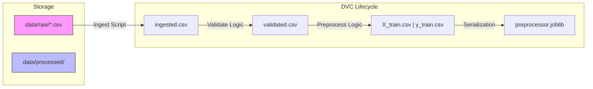

# 🗄️ Data Management Layer

## 🧬 Data Lineage & Flow

The system strictly segregates raw input from processed artifacts to ensure zero data leakage and 100% reproducibility.

```mermaid
graph LR
    subgraph "Storage"
        RAW["data/raw/*.csv"]
        PROC["data/processed/"]
    end

    subgraph "DVC Lifecycle"
        RAW -- "Ingest Script" --> INGESTED["ingested.csv"]
        INGESTED -- "Validate Logic" --> VALIDATED["validated.csv"]
        VALIDATED -- "Preprocess Logic" --> ENCODED["X_train.csv | y_train.csv"]
        ENCODED -- "Serialization" --> JOB["preprocessor.joblib"]
    end

    style RAW fill:#f9f,stroke:#333
    style PROC fill:#bbf,stroke:#333
```

---

## 📋 Technical Schema Contract

All clinical records must adhere to this contract. The `Validate` stage and the `Inference API` both use this as the single source of truth.

### Numeric Features

| Field | Range | Constraints |
| :--- | :--- | :--- |
| `Age` | 18 – 79 | Integer |
| `Dosage_mg` | [50, 100, 250, 500, 850] | Fixed Categorical-Numeric |
| `Treatment_Duration_days` | 5 – 59 | Daily integer count |

### Categorical Features (Labels)

* **Gender**: `Female`, `Male`
* **Condition**: `Depression`, `Diabetes`, `Hypertension`, `Infection`, `Pain Relief`
* **Drug_Name**: (15 validated pharmaceutical identifiers)
* **Side_Effects**: (30 validated clinical reports)

---

## 🛠️ Management Commands

| Goal | Command |
| :--- | :--- |
| **Pull Artifacts** | `dvc pull` |
| **Check Data Status** | `dvc status` |
| **Purge & Refresh** | `rm -rf data/processed/* && dvc repro` |

---

## 🚫 Safe State Guarantees

1. **Immutability**: `data/raw/` is never modified by the code.
2. **Tracking**: Every file in `data/processed/` is tracked by `.dvc` files to prevent large binaries in Git.
3. **Encapsulation**: Preprocessing transformers (`preprocessor.joblib`) are packaged for identical usage in both Training and Serving layers.
