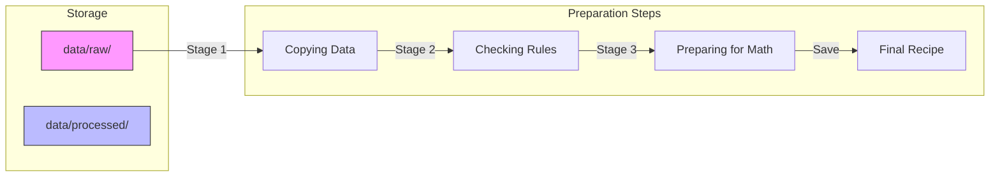

# 🗄️ Data Management

## 🧬 How Data Flows

The system keeps the original data clean and separate from the processed versions used by the AI. This ensures that every result can be repeated exactly.

```mermaid
graph LR
    subgraph "Storage"
        RAW["data/raw/"]
        PROC["data/processed/"]
    end

    subgraph "Preparation Steps"
        RAW -- "Stage 1" --> INGESTED["Copying Data"]
        INGESTED -- "Stage 2" --> VALIDATED["Checking Rules"]
        VALIDATED -- "Stage 3" --> ENCODED["Preparing for Math"]
        ENCODED -- "Save" --> JOB["Final Recipe"]
    end

    style RAW fill:#f9f,stroke:#333
    style PROC fill:#bbf,stroke:#333
```

---

## 📋 Data Rules

Every patient record must follow these rules. Both the preparation steps and the web app use these exact same rules.

### Number Rules

| Category | Allowed Range | Type |
| :--- | :--- | :--- |
| `Age` | 18 – 79 | Whole Number |
| `Dosage_mg` | 50, 100, 250, 500, or 850 | Specific Options |
| `Duration` | 5 – 59 | Days |

### Label Rules

* **Gender**: `Female` or `Male`
* **Condition**: `Depression`, `Diabetes`, `Hypertension`, `Infection`, or `Pain Relief`
* **Drug Names**: 15 specific medicines are supported.
* **Side Effects**: 30 standard medical observations are supported.

---

## 🛠️ Handy Commands

| Goal | Command |
| :--- | :--- |
| **Update Data** | `dvc pull` |
| **Check Status** | `dvc status` |
| **Fresh Start** | `rm -rf data/processed/* && dvc repro` |

---

## 🚫 Safe Data Handling

1. **Protected Source**: The code never changes the files in `data/raw/`.
2. **Detailed Tracking**: Every step taken to prepare the data is remembered by the system.
3. **Consistency**: The same "recipe" used to prepare data for learning is used when making new predictions.
