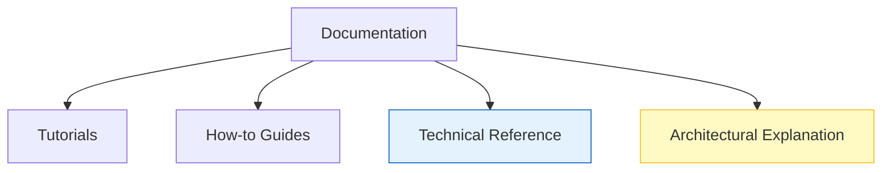

# 📚 Knowledge Base & Documentation

**Central repository for technical deep-dives, RFCs, and architectural decision records.**

[⬅️ Back to Root](../README.md)

---

## 1. Document Index

| Document | Category | Description |
| :--- | :--- | :--- |
| **[Model Monitoring](./model_monitoring.md)** | `SPEC` | Architectural proposal for data drift and bias detection (RFC). |
| **[Root Guide](../README.md)** | `GUIDE` | Deployment, Setup, and System Overview. |
| **[Contributing](./CONTRIBUTING.md)** | `POLICY` | Standards for code, security, and medical validation. |

---

## 2. Documentation Architecture

We follow the **Diátaxis** framework to ensure documentation serves its intended purpose:

### Reference vs. Explanation

- **Sub-READMEs** (e.g., `inference/README.md`) serve as **Refrence** for specific modules.
- **Docs Folder** (this directory) contains **Explanations** and long-term **Specs**.

---

## 3. Writing Standards

All documentation must adhere to the following:

- **Mermaid Diagrams**: Used for any flow or architecture change.
- **Executive Summaries**: Every file must start with "Purpose", "Business Problem", and "Solution".
- **Zero-Trust Context**: Every doc must highlight security boundaries.

---

## 🔮 Future Roadmap

- [ ] **Data Dictionary**: Comprehensive definition of all 1000+ synthetic clinical fields.
- [ ] **Deployment ADRs**: Detailed logs of why specific K8s configurations were chosen.
- [ ] **Medical Validation API**: Swagger UI documentation link.
