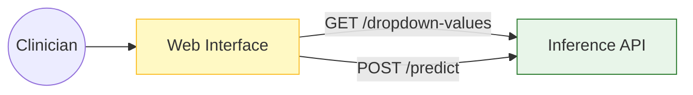

# 🎨 Clinical Web Interface

<div align="center">


**A lightweight, zero-dependency dashboard for clinical predictions.**
*Verified for local execution.*

[⬅️ Back to Root](../README.md)

</div>

---

## 1. Executive Overview

### Purpose

The Clinical Web Interface provides a user-friendly way for researchers and clinicians to interact with the Inference Model. It abstracts the JSON API into a structured form with client-side validation and visualization.

### Business Problem

* **Accessibility**: Clinicians are not coders; they cannot use `curl` or Postman to get predictions.
* **Safety**: Manual JSON entry leads to typos and invalid data submissions.

### Solution

* **Zero Dependencies**: Built with Vanilla JS and CSS. No `node_modules`, no build step, no Webpack. Instant load times.
* **Schema-Driven**: Dropdowns are populated dynamically from the Backend API, ensuring the UI never drifts from the `params.yaml` configuration.

### Architectural Positioning

This is the **Presentation Layer**. It runs in the client's browser and is completely decoupled from the backend logic.

---

## 2. System Context & Architecture

### System Context



### Interactions

* **User**: Interacts with HTML Form.
* **API**: Source of Truth for valid input values (enums) and Prediction logic.

### Design Principles

* **Progressive Enhancement**: Works as a basic form, enhanced with JS for dynamic updates.
* **Keep It Simple (KISS)**: No framework (React/Vue) overhead for a single-page internal tool.

---

## 3. Component-Level Design

### Modules

| File | Role | Key Functions |
| :--- | :--- | :--- |
| `index.html` | **Structure** | Contains the semantic HTML5 form and result containers. |
| `styles.css` | **Presentation** | Defines CSS Variables (Theming), Grid Layouts, and Animations. |
| `app.js` | **Logic** | `fetchConfig()` (Init), `handlePredict()` (Form Submit), `renderResult()` (UI Update). |

---

## 4. Data Design

### State Management

The application manages local state for form inputs and API responses. The flow is strictly unidirectional.

1. **Init**: Fetch Valid Enums from `/dropdown-values`.
2. **Input**: User fills form.
3. **Submit**: Construct JSON payload consistent with `PredictionRequest` schema.
4. **Render**: Display `Improvement_Score` or Error Message.

---

## 5. API Design (Consumer)

### Consumed Endpoints

| Method | Endpoint | Use Case |
| :--- | :--- | :--- |
| `GET` | `/dropdown-values` | Populates `<select>` options on page load. |
| `POST` | `/predict` | Sends payload, receives score. |

---

## 6. Execution Flow

### User Interaction

```mermaid
sequenceDiagram
    participant User
    participant DOM as HTML Page
    participant App as app.js
    participant API as Backend Service

    Note over App, API: Initialization
    App->>API: GET /dropdown-values
    API-->>App: {genders, drugs, ...}
    App->>DOM: Populate <select> options

    Note over User, API: Interaction
    User->>DOM: Selects 'Hypertension'
    User->>DOM: Clicks 'Predict'
    DOM->>App: Event: submit
    App->>API: POST /predict (JSON)
    API-->>App: {score: 7.2}
    App->>DOM: Render Result Card
```



---

## 7. Infrastructure & Deployment

### Runtime

* **Local**: `python -m http.server`
* **Docker**: Nginx container serving static files.

### Configuration

* **API URL**: Hardcoded to `/api` (relative path) or `http://localhost:8000` depending on env.

---

## 8. Security Architecture

### Defenses

* **Sanitization**: `innerText` is used instead of `innerHTML` to prevent XSS when rendering API responses.
* **CORS**: The browser enforces CORS policies if the API is on a different domain.

---

## 9. Performance & Scalability

* **Load Time**: < 100kb total size. Instant loading.
* **Caching**: Aggressive caching of static assets possible via Nginx.

---

## 10. Reliability & Fault Tolerance

* **API Down**: If `/dropdown-values` fails, the form disables itself and shows a "Service Unavailable" banner.
* **Error Handling**: API errors (422/500) are parsed and displayed as user-friendly alerts.

---

## 11. Observability

* **Console Logs**: `console.error` used for debugging network failures.

---

## 12. Testing Strategy

### Valid Test Case

| Field | Value |
| :--- | :--- |
| **Age** | `45` |
| **Gender** | `Male` |
| **Condition** | `Hypertension` |
| **Drug** | `Amlodipine` |
| **Dosage** | `50` |
| **Duration** | `30` |

*Expected*: Success Card with Score ~7.42.

---

## 13. Configuration

No environment variables needed for the static frontend itself, other than Nginx config.

---

## 14. Development Guide

### Running Locally

```bash
# 1. Start API 
make run-api

# 2. Start Frontend
make run-frontend
```

Access at `http://localhost:8080`.

---

## 15. Future Improvements

* **Offline Support**: Add Service Worker.
* **History**: Save recent predictions to `localStorage`.

---
