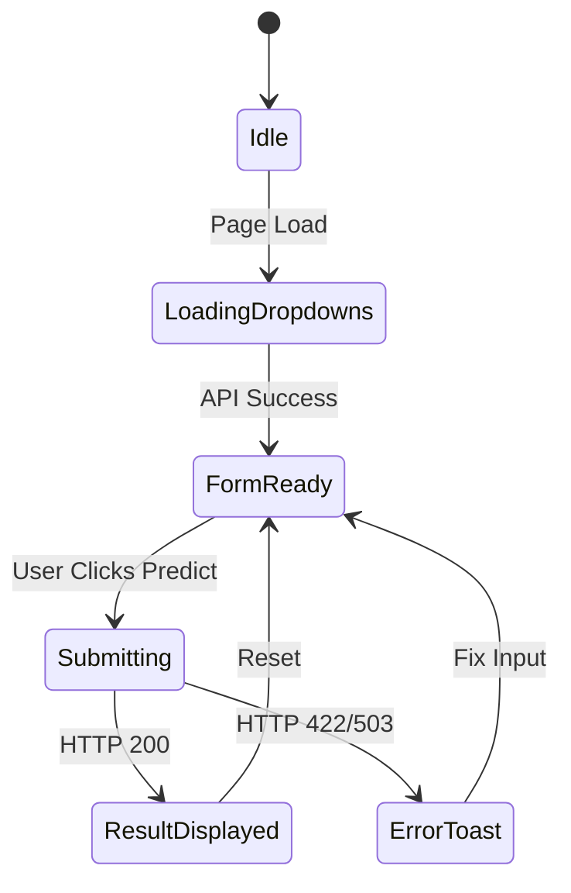

# 🎨 Clinical Web Interface

<div align="center">


</div>

## ✨ The Premium Experience

The frontend is a bespoke, responsive dashboard designed for clinical researchers. It prioritizes data integrity and visual impact through a "Glassmorphic" design system.

### Core Features

* **Dynamic Data Binding**: Category dropdowns are not hardcoded; they sync instantly with the ML lifecycle via the `/dropdown-values` endpoint.
* **Animated Visualization**: Prediction results (0–10) are rendered using a high-fidelity SVG circle gauge with micro-animations.
* **Zero-Tab Failure**: Reactive error handling displays API validation errors directly within the UI context.

---

## 🏗️ Technical State Flow


```mermaid
stateDiagram-v2
    [*] --> Idle
    Idle --> LoadingDropdowns: Page Load
    LoadingDropdowns --> FormReady: API Success
    FormReady --> Submitting: User Clicks Predict
    Submitting --> ResultDisplayed: HTTP 200
    Submitting --> ErrorToast: HTTP 422/503
    ResultDisplayed --> FormReady: Reset
    ErrorToast --> FormReady: Fix Input
```

---

## 🏃 Launch Instructions

The frontend is a static asset set and can be served by any web server.

### Option 1: Development Server

```bash
cd frontend && python -m http.server 8080
```

### Option 2: Production Container

```bash
docker build -t mlops-frontend -f infra/docker/Dockerfile.frontend .
docker run -p 8080:80 mlops-frontend
```

---

## 🎨 Design Philosophy

* **Dark Mode Native**: Reduces eye strain for clinical research environments.
* **Disclaimer First**: The non-clinical statement is pinned to the header to prevent misuse of the tool for primary diagnosis.
* **Responsive Grid**: Optimized for both high-resolution workstations and mobile field tablets.

---

## 🌐 API Interaction

The UI expects the Inference API to be available at `http://localhost:8000`. This can be adjusted in `app.js` for remote deployments.
