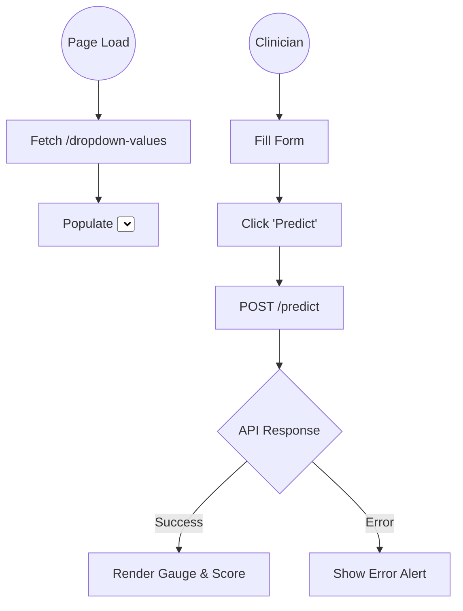

# 🎨 Clinical Web Interface

<div align="center">


**A lightweight, zero-dependency dashboard for clinical predictions.**
*Verified for local execution.*

[⬅️ Back to Root](../README.md)

</div>

---

## 📱 State Management & Data Flow

The frontend follows a unidirectional data flow pattern, driven by the Backend's schema.


```mermaid
graph TD
    Init((Page Load)) --> FetchConfig[Fetch /dropdown-values]
    FetchConfig --> Populate[Populate <select> Options]
    
    User((Clinician)) --> Input[Fill Form]
    Input --> ClickPredict[Click 'Predict']
    
    ClickPredict --> POST[POST /predict]
    POST --> API{API Response}
    
    API -- Success --> Render[Render Gauge & Score]
    API -- Error --> Alert[Show Error Alert]
```

---

## 🧠 Design Decisions

| Decision | Rationale |
| :--- | :--- |
| **Vanilla JS (No Framework)** | For a simple dashboard, React/Vue adds unnecessary build complexity (npm install, webpack, etc.). This runs natively in any browser. |
| **Dynamic Dropdowns** | Hardcoding values in HTML (`<option value="DrugA">`) drift from the backend. We fetch valid values from `/dropdown-values` (driven by `params.yaml`) to ensure synchronization. |
| **CSS Variables** | Used for theming (Dark Mode ready) without needing a preprocessor like SASS. |

---

## 🧪 Valid Test Case

Use this data to verify the system is working:

| Field | Value |
| :--- | :--- |
| **Age** | `45` |
| **Gender** | `Male` |
| **Condition** | `Hypertension` |
| **Drug** | `Amlodipine` |
| **Dosage** | `50` |
| **Duration** | `30` |

---

## 🚀 How to Run

### Option 1: Using Make (Recommended)

```bash
make run-frontend
```

*Access at: `http://localhost:8080`*

### Option 2: Manual Start

```bash
cd frontend
python3 -m http.server 8080
```

> [!IMPORTANT]
> **Prerequisite**: The Prediction API must be running on `http://localhost:8000`.

---

## 📁 Directory Manifest

| File | Description |
| :--- | :--- |
| `index.html` | The HTML5 structure. Contains the form and result containers. |
| `app.js` | Business logic. form handling, API fetching, DOM manipulation. |
| `styles.css` | Styling. Flexbox/Grid layouts, animations, and responsive design. |

---

## ❓ Troubleshooting

| Issue | Cause | Fix |
| :--- | :--- | :--- |
| **Dropdowns Empty** | Frontend cannot reach API (`/dropdown-values` failed). | Ensure API is running on port 8000. Check console for CORS errors. |
| **"Network Error"** | API is down or blocking the request. | Check Validation/Network tab in Developer Tools. |
| **Visual Glitches** | Old CSS cached. | Hard refresh (`Cmd+Shift+R`). |
