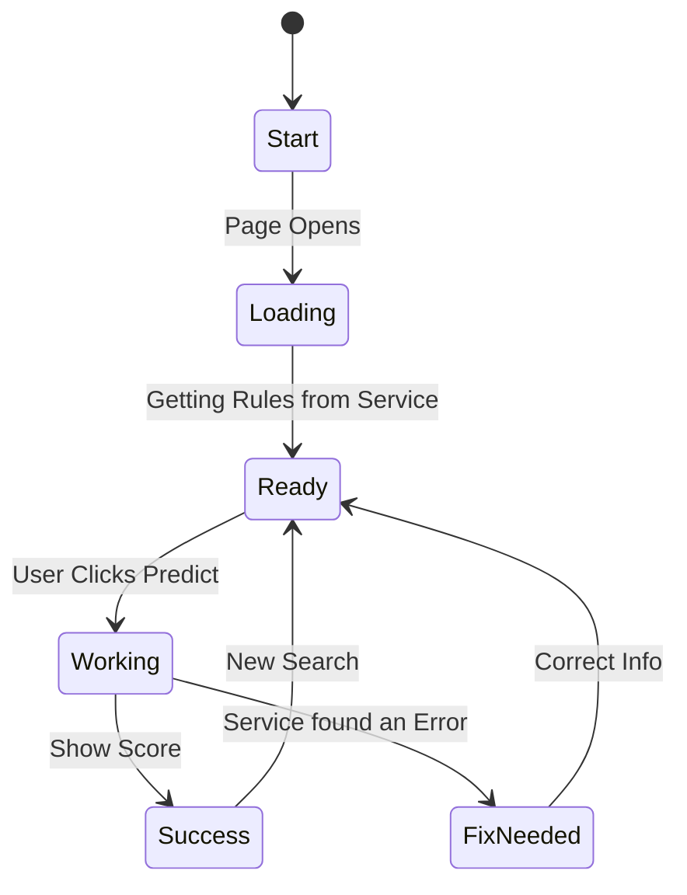

# 🎨 Clinical Web Interface

<div align="center">


</div>

## ✨ A User-Friendly Dashboard

This web application is designed to be simple and clear for researchers. It makes it easy to enter patient details and see the predicted results instantly.

### Key Features

* **Automatic Lists**: The dropdown choices for conditions and drugs stay updated automatically as the system changes.
* **Visual Results**: Predicted scores are shown on an easy-to-read circular gauge.
* **Safety Reminders**: Important clinical disclaimers are always visible to ensure proper use.

---

## 🏗️ How the App Behaves


```mermaid
stateDiagram-v2
    [*] --> Start
    Start --> Loading: Page Opens
    Loading --> Ready: Getting Rules from Service
    Ready --> Working: User Clicks Predict
    Working --> Success: Show Score
    Working --> FixNeeded: Service found an Error
    Success --> Ready: New Search
    FixNeeded --> Ready: Correct Info
```

---

## 🏃 How to Open the App

The app is a simple set of files that can be opened in any web browser.

### Simple Start

```bash
cd frontend && python -m http.server 8080
```

Then visit: `http://localhost:8080`

---

## 🩺 Interaction

The web app talks to the "Prediction Service" running on your computer. If the service isn't running, the web app won't be able to calculate new scores.
