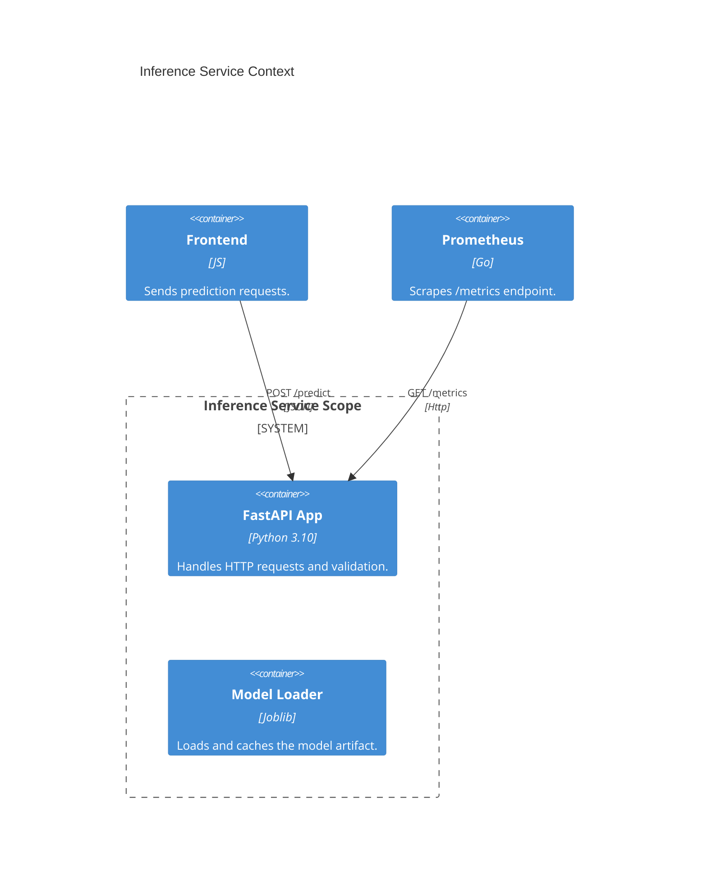
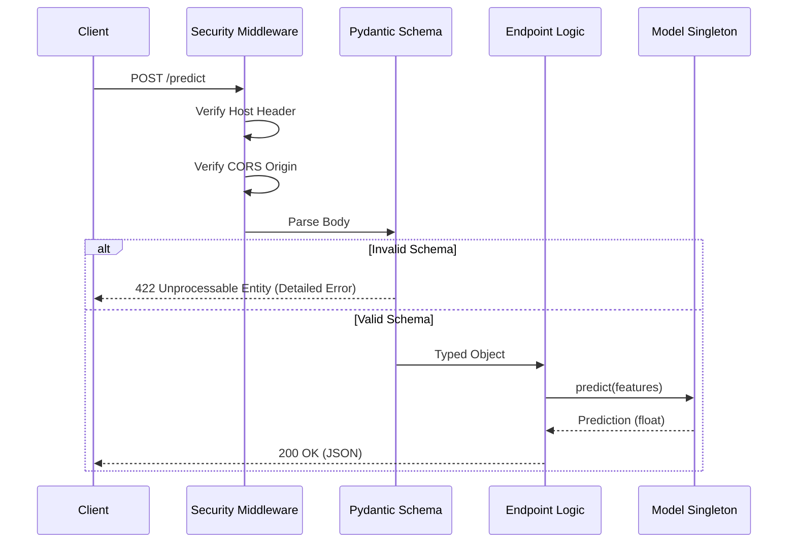

# ⚡ Prediction Service (Inference)

<div align="center">


**A hardened, schema-enforcing inference engine.**
*Verified for local execution and containerized deployment.*

[⬅️ Back to Root](../README.md)

</div>

---

## 1. Executive Overview

### Purpose

The Inference Service is the synchronous entry point for all model predictions. It exposes a REST API that accepts clinical patient data, validates it against a strict schema, and returns a treatment outcome improvement score.

### Business Problem

Deploying ML models often introduces risks:

* **Data Drift**: Input data format changes silently break the model.
* **Security**: ML Models can be attack vectors (e.g., pickle injection, DOS).
* **Visibility**: "Black box" services make debugging production failures impossible.

### Solution

This service addresses these by:

* **Schema Enforcement**: Rejecting malformed data *before* it touches the model.
* **Observability**: Emitting high-fidelity metrics for every request.
* **Isolation**: Running in a secure, non-root container environment.

### Architectural Positioning

It acts as the **Gateway** between external clients (Frontend) and the internal Model Artifact. It is stateless and horizontally scalable.

---

## 2. System Context & Architecture

### System Context



### Interactions

* **Frontend**: Sends `POST /predict` requests.
* **Prometheus**: Scrapes `GET /metrics`.
* **Filesystem**: Reads `models/model.joblib` on startup.

### Design Principles

* **Fail-Fast**: If the model or config is missing, the service crashes immediately (allowing K8s to restart it), rather than serving 500 errors.
* **Singleton Pattern**: The heavy model is loaded once globally, not per-request.

---

## 3. Component-Level Design

### Core Modules

| Module | Responsibility | Dependencies | Public Interface |
| :--- | :--- | :--- | :--- |
| `app.py` | **Controller**. Application entry point, routing, middleware. | `fastapi`, `uvicorn` | `app` instance |
| `schemas.py` | **DTOs**. Pydantic definitions for Request/Response objects. | `pydantic` | `PredictionRequest` |
| `model_loader.py` | **Service**. Singleton class for safe model loading. | `joblib`, `sklearn` | `ModelLoader` |

### Dependency Flow

`app.py` -> `schemas.py` (Validation) -> `model_loader.py` (Inference)

---

## 4. Data Design

### Schema Structure

Data validation is strict and defined in `inference/schemas.py`.

* **Input**: `PredictionRequest`
  * `Patient_ID`: String
  * `Age`: Int (0-100)
  * `Gender`: Enum (Male/Female)
  * ...
* **Output**: `PredictionResponse`
  * `Improvement_Score`: Float
  * `model_version`: String hash

### Validation Rules

All rules are sourced from `params.yaml` to ensure the API matches the training data exactly.

---

## 5. API Design

### Principles

* **RESTful**: Standard HTTP verbs and status codes.
* **Stateless**: No client context stored.
* **Self-Documenting**: OpenAPI (Swagger) specs generated automatically.

### Endpoints

| Method | Endpoint | Description | Auth |
| :--- | :--- | :--- | :--- |
| `POST` | `/predict` | Main inference endpoint. Returns score. | Internal |
| `GET` | `/health` | Liveness check. Returns 503 if model not loaded. | No |
| `GET` | `/metrics` | Prometheus metrics scrape target. | No |
| `GET` | `/dropdown-values` | Returns valid enum values for frontend forms. | No |

---

## 6. Execution Flow

### Request Lifecycle



---

## 7. Infrastructure & Deployment

### Runtime

* **Base Image**: `python:3.11-slim`
* **Server**: Uvicorn (ASGI)

### Configuration

Environment variables control behavior:

* `MODEL_PATH`: Path to `.joblib` file.
* `PREPROCESSOR_PATH`: Path to preprocessor.

---

## 8. Security Architecture

### Defenses

* **Host Header Validation**: `TrustedHostMiddleware` prevents Host header attacks.
* **CORS Policy**: `CORSMiddleware` restricts browser access to specific origins.
* **Security Headers**: Custom Middleware enforces HSTS, X-Content-Type-Options, CSP.
* **Information Hiding**: Internal exceptions are caught; generic errors returned to client.

---

## 9. Performance & Scalability

* **Latency**: Typical inference time < 50ms (Random Forest).
* **Throughput**: Limited by CPU.
* **Scaling**: Stateless design allows infinite horizontal scaling (add more pods).

---

## 10. Reliability & Fault Tolerance

* **Startup Checks**: Service verifies model existence on boot.
* **Timeout Handling**: Uvicorn handles request timeouts.
* **Graceful Degradation**: If model fails, `/health` returns 503, removing the pod from LoadBalancer rotation.

---

## 11. Observability

### Metrics

We expose standard RED metrics (Rate, Errors, Duration) plus business metrics:

* `api_request_total`: Operations traffic.
* `api_prediction_total`: Successful predictions.
* `model_info`: Version tracking.

### Logging

Structured JSON logging for automated ingestion (ELK/Splunk).

---

## 12. Testing Strategy

* **Unit Tests**: Verify `ModelLoader` behavior.
* **Integration Tests**: `make validate` spins up the API and curls it.

---

## 13. Configuration Table

| Variable | Type | Default | Description |
| :--- | :--- | :--- | :--- |
| `MODEL_PATH` | Path | `models/model.joblib` | Logic artifact path. |
| `PORT` | Int | `8000` | Listening port. |

---

## 14. Development Guide

### Running Locally

```bash
# 1. Generate Model
make run-pipeline

# 2. Start API
make run-api
```

### Debugging

* Check `/docx` for Swagger UI.
* Check `/metrics` for internal state.

---

## 15. Future Improvements

* **Async Interface**: Add Celery for long-running batch predictions.
* **GRPC Support**: For lower-latency internal communication.

---
