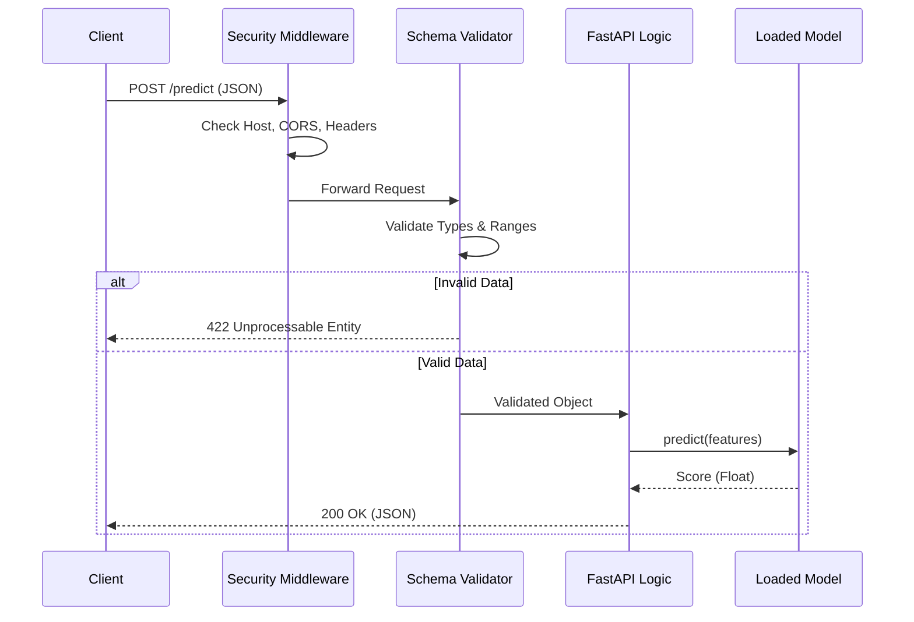

# ⚡ Prediction Service (Inference)

<div align="center">


**A hardened, schema-enforcing inference engine.**
*Verified for local execution.*

[⬅️ Back to Root](../README.md)

</div>

---

## 🔄 Request/Response Architecture

Requests pass through multiple layers of defense before reaching the model.


```mermaid
sequenceDiagram
    participant Client
    participant Middleware as Security Middleware
    participant Pydantic as Schema Validator
    participant App as FastAPI Logic
    participant Model as Loaded Model

    Client->>Middleware: POST /predict (JSON)
    Middleware->>Middleware: Check Host, CORS, Headers
    Middleware->>Pydantic: Forward Request
    Pydantic->>Pydantic: Validate Types & Ranges
    
    alt Invalid Data
        Pydantic-->>Client: 422 Unprocessable Entity
    else Valid Data
        Pydantic->>App: Validated Object
        App->>Model: predict(features)
        Model-->>App: Score (Float)
        App-->>Client: 200 OK (JSON)
    end
```

---

## 🧠 Design Decisions & Security

| Feature | Implementation | Why? |
| :--- | :--- | :--- |
| **Middleware Defense** | `TrustedHostMiddleware`, `CORSMiddleware`. | Prevents host header attacks and unauthorized browser access. |
| **Input Sanitization** | Pydantic Models (`PatientData`). | Prevents "garbage in" and potential injection attacks via malformed payloads. |
| **Singleton Model** | Global `model` variable loaded on startup. | Prevents reloading the heavy model file for every single request (Latency optimization). |
| **Fail-Fast Startup** | App crashes if `model.joblib` is missing. | Better to crash immediately than to serve 500 Errors to users. |

---

## 🚀 How to Run

### Option 1: Using Make (Recommended)

```bash
make run-api
```

*Service available at: `http://localhost:8000`*

### Option 2: Manual Start

```bash
python -m uvicorn inference.app:app --host 0.0.0.0 --port 8000 --reload
```

---

## 🧪 Interactive Testing

### Curl Example

Test the API from your terminal:

```bash
curl -X 'POST' \
  'http://localhost:8000/predict' \
  -H 'Content-Type: application/json' \
  -d '{
  "Patient_ID": "P1234",
  "Age": 45,
  "Gender": "Male",
  "Condition": "Hypertension",
  "Drug_Name": "Amlodipine",
  "Dosage_mg": 50,
  "Treatment_Duration_days": 30,
  "Side_Effects": "None"
}'
```

*Expected Response:* `{"prediction_score": 7.42, "model_version": "..."}`

---

## 🔌 API Endpoints

| Method | Path | Description | Verified |
| :--- | :--- | :--- | :--- |
| `GET` | `/health` | Liveness/Readiness probe. Returns **503** if model not loaded. | ✅ |
| `POST` | `/predict` | Main inference endpoint. Enforces strict schema. | ✅ |
| `GET` | `/metrics` | Prometheus metrics scrape target. | ✅ |
| `GET` | `/dropdown-values` | Dynamic schema values for frontend. | ✅ |

---

## 📁 Directory Manifest

| File | Description |
| :--- | :--- |
| `app.py` | FastAPI application entry point. Routes and Middleware. |
| `model_loader.py` | Singleton class for safe model loading. |
| `schemas.py` | Pydantic definitions for Request/Response objects. |

---

## ❓ Troubleshooting

| Error | Cause | Fix |
| :--- | :--- | :--- |
| `Model not found` | `models/model.joblib` missing. | Run `make run-pipeline` to generate the model. |
| `422 Unprocessable` | Input data violates schema (e.g. Age 100). | Check input against `params.yaml` limits. |
| `Connection refused` | Port 8000 occupied. | Kill existing process or change port in `Makefile`. |
