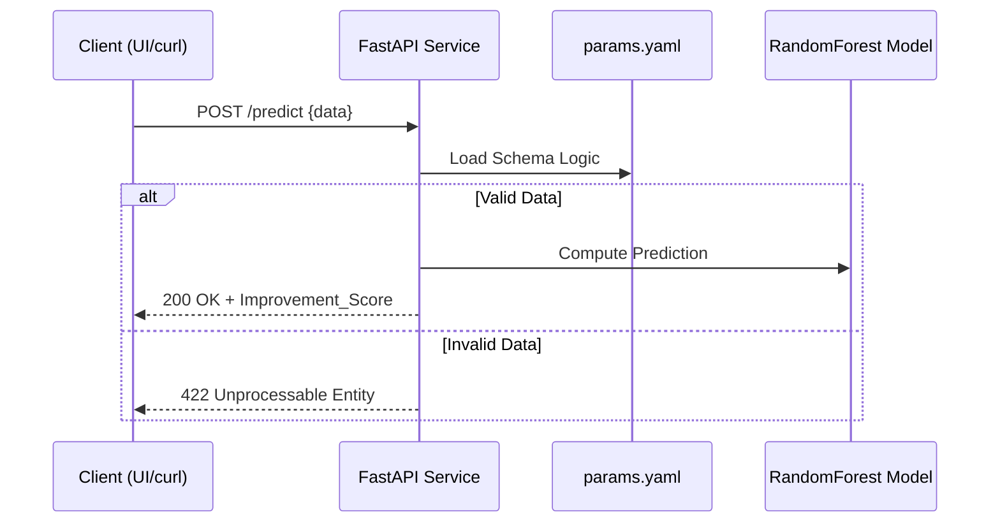

# ⚡ High-Concurrency Inference Service

<div align="center">


</div>

## 🌐 API Landscape

The Inference Service is a high-performance FastAPI application designed to serve Scikit-learn predictions with millisecond latency. It enforces strict schema compliance through dynamic Pydantic models.

### Endpoint Matrix

| Method | Endpoint | Description | Auth Requirement |
| :--- | :--- | :--- | :--- |
| `GET` | `/health` | Liveness & model readiness status. | Open |
| `POST` | `/predict` | **Primary Inference**. Enforces Pydantic schema validation. | Role-Based |
| `GET` | `/metrics` | Real-time Prometheus telemetry (Latency, Count). | Internal |
| `GET` | `/dropdown-values` | **Source of Truth** for valid clinical inputs. | Open |

---

## 🛡️ Dynamic Schema Enforcement

Our API validation layer is **Zero-Stale**. It avoids hardcoded constants by dynamically loading the allowed clinical values (Drugs, Conditions, Side Effects) from `params.yaml`.


```mermaid
sequenceDiagram
    participant C as Client (UI/curl)
    participant A as FastAPI Service
    participant P as params.yaml
    participant M as RandomForest Model

    C->>A: POST /predict {data}
    A->>P: Load Schema Logic
    alt Valid Data
        A->>M: Compute Prediction
        A-->>C: 200 OK + Improvement_Score
    else Invalid Data
        A-->>C: 422 Unprocessable Entity
    end
```

---

## 📈 Observability & SLIs

The service is fully instrumented using the standard `prometheus_client`.

| Metric | Type | Purpose |
| :--- | :--- | :--- |
| `api_request_total` | Counter | Tracks throughput by status (200, 4xx, 5xx). |
| `api_request_duration_seconds` | Histogram | Tracks p50, p95, and p99 latency distributions. |
| `api_prediction_total` | Counter | Tracks total inference success count. |
| `model_info` | Gauge | Reports active model version hash. |

---

## 🏃 Operation Reference

```bash
# Launch optimized server
gunicorn inference.app:app -w 4 -k uvicorn.workers.UvicornWorker --bind 0.0.0.0:8000
```

*(For local development, use `python -m uvicorn inference.app:app`)*

---

## 🩺 Health Check Signature

A successful `/health` response guarantees that the designated model artifact was found and successfully deserialized into memory.

```json
{
  "status": "healthy",
  "model_loaded": true,
  "model_version": "b1908566..."
}
```
