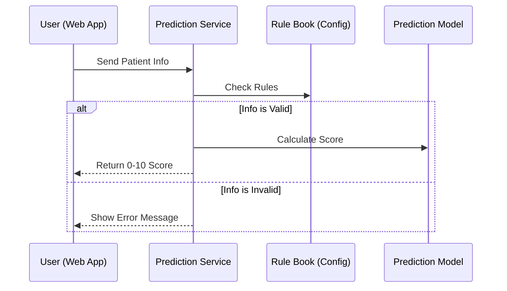

# ⚡ Prediction Service

<div align="center">


</div>

## 🌐 How the Service Works

The Prediction Service is the engine that connects our math model to the web app. It receives patient information, checks it against our rules, and returns a predicted improvement score.

### Service Routes

| Path | What it does |
| :--- | :--- |
| `/health` | Shows if the service and model are ready to go. |
| `/predict` | **Main Engine**. Takes patient data and returns a score. |
| `/metrics` | Tracks how many people are using the system. |
| `/dropdown-values` | Provides the list of valid drugs and conditions for the app. |

---

## 🛡️ Automatic Rule Updates

The service is smart. It doesn't use static lists; instead, it automatically loads the latest rules (like valid drug names) from our central configuration file.


```mermaid
sequenceDiagram
    participant C as User (Web App)
    participant A as Prediction Service
    participant P as Rule Book (Config)
    participant M as Prediction Model

    C->>A: Send Patient Info
    A->>P: Check Rules
    alt Info is Valid
        A->>M: Calculate Score
        A-->>C: Return 0-10 Score
    else Info is Invalid
        A-->>C: Show Error Message
    end
```

---

## 🏃 Running the Service

```bash
# Start the prediction engine
python -m uvicorn inference.app:app --host 0.0.0.0 --port 8000
```

---

## 🩺 System Status

When you check the `/health` link, you should see:

```json
{
  "status": "healthy",
  "model_ready": true,
  "version": "b1908566..."
}
```

This confirms that the system has successfully loaded the latest "learned patterns" and is ready to help.
