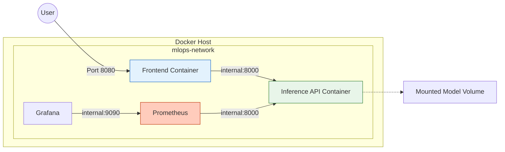
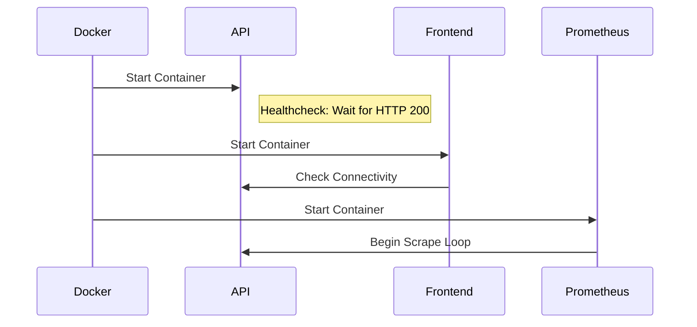

# 🏗️ Infrastructure & Deployment

<div align="center">


**Production-grade container definitions and orchestration manifests.**
*Supports Docker Compose (Local) and Kubernetes (Production).*

[⬅️ Back to Root](../README.md)

</div>

---

## 1. Executive Overview

### Purpose

This module defines the runtime environment for the MLOps system. It encapsulates the application logic into immutable containers and defines how they are orchestrated, networked, and monitored.

### Business Problem

* **"It works on my machine"**: Code behaving differently in production due to OS/Lib mismatches.
* **Scalability**: Monolithic deployments are hard to scale selectively (e.g., scaling only Inference, not the Frontend).
* **Security**: Running apps as `root` exposes the host to container breakouts.

### Solution

* **Immutable Infrastructure**: Build once, deploy anywhere (Dev/Staging/Prod).
* **Isolation**: Each component runs in its own container with defined resource boundaries.
* **Observability First**: Monitoring sidecars (Prometheus/Grafana) are first-class citizens.

### Architectural Positioning

This is the **Platform Layer**. It sits below the Application Layer (`inference/`, `frontend/`) and manages their lifecycle.

---

## 2. System Context & Architecture

### Network Topology (Local Dev)

The system uses a private bridge network (`mlops-network`) effectively isolating the backend services from the public internet, exposing only necessary ports.



### Interactions

* **Frontend -> API**: HTTP REST over internal network.
* **Prometheus -> API**: HTTP Scraping over internal network.
* **User -> Frontend**: Public exposure via Port 8080.

### Design Principles

* **Sidecar Pattern**: Monitoring agents run alongside the application.
* **Configuration Injection**: All config is injected via Environment Variables, making images environment-agnostic.

---

## 3. Component-Level Design

### Docker Images

| Service | Dockerfile | Base Image | Logic |
| :--- | :--- | :--- | :--- |
| **Inference API** | `infra/docker/Dockerfile.inference` | `python:3.11-slim` | Multi-stage build. Installs dependencies, copies model artifacts + code, runs Uvicorn. |
| **Frontend** | `infra/docker/Dockerfile.frontend` | `nginx:alpine` | Static file serving. Copies HTML/JS/CSS to Nginx html root. |

### Orchestration

| Tool | Config File | Purpose |
| :--- | :--- | :--- |
| **Docker Compose** | `docker-compose.yml` | Local development. Spins up full stack + monitoring in one command. |
| **Kubernetes** | `infra/k8s/*.yaml` | Production deployment. Defines Deployments, Services, and ConfigMaps. |

---

## 4. Data Design

### Volume Management

* **Model Artifacts**: The API container needs access to `models/model.joblib`. In local dev, this is a bind mount. In K8s, it would be a PersistentVolumeClaim or an InitContainer download.
* **Prometheus Data**: `prometheus-data` volume persists metrics across restarts.

---

## 5. Execution Flow

### Container Startup Sequence (Compose)



---

## 6. Infrastructure & Deployment

### Run Guide

#### Option A: Docker Compose (Local)

1. **Build & Run**:

    ```bash
    docker compose -f infra/docker/docker-compose.yml up --build -d
    ```

2. **Verify Services**:
    * Frontend: `http://localhost:8080`
    * API Health: `http://localhost:8000/health`
    * Grafana: `http://localhost:3000`

#### Option B: Kubernetes (Production)

1. **Create Namespace**:

    ```bash
    kubectl apply -f infra/k8s/namespace.yaml
    ```

2. **Apply Manifests**:

    ```bash
    kubectl apply -f infra/k8s/
    ```

---

## 8. Security Architecture

### Compliance Implemented

* **Non-Root Execution**: `Dockerfile.inference` creates a dedicated `appuser` (UID 1000). The process never runs as root.
* **Read-Only Filesystem**: (K8s) Pods can be configured with `readOnlyRootFilesystem: true` (application writes only to `/tmp`).
* **Secret Management**: Sensitive values (e.g., Grafana Password) are injected via Environment Variables, never hardcoded.

---

## 9. Performance & Scalability

* **Horizontal Scaling**: The API is stateless. In K8s, simply increase `replicas: 3`.
* **Load Balancing**: K8s Service (ClusterIP) balances traffic across all healthy API pods.

---

## 10. Reliability & Fault Tolerance

* **Liveness Probes**: K8s restarts the pod if `/health` fails N times.
* **Restart Policy**: `restart: unless-stopped` ensures resilience against temporary crashes.

---

## 11. Observability

### Stack

* **Metrics**: Prometheus (Time Series database).
* **Visualization**: Grafana (Dashboards).

---

## 12. Testing Strategy

* **Structure Tests**: `docker build --check` ensures valid Dockerfiles.
* **Dry Run**: `kubectl apply --dry-run` ensures valid manifests.

---

## 13. Configuration Table

| Env Variable | Default | Description |
| :--- | :--- | :--- |
| `MODEL_PATH` | `models/model.joblib` | Path inside the container to the model. |
| `GRAFANA_ADMIN_PASSWORD` | `changeme` | Admin password for Grafana. |

---

## 14. Development Guide

### Adding a Service

1. Create `Dockerfile.myservice`.
2. Add entry to `docker-compose.yml`.
3. Add K8s manifest in `infra/k8s/`.

---

## 15. Future Improvements

* **Helm Charts**: Templatize K8s manifests for easier multi-environment deployment.
* **Service Mesh**: Integrate Istio for mutual TLS (mTLS) between services.

---
