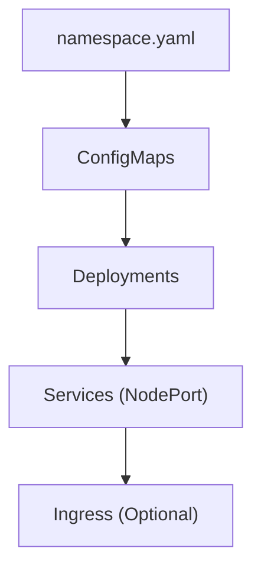

# 🏗️ Infrastructure & Orchestration

<div align="center">


</div>

## 🐳 Docker Stack

Our registry uses multi-stage builds to optimize image size and security. The stack is segmented into three primary domains: **Training**, **Serving**, and **Edge UI**.

### Image Hierarchy

| Service | Dockerfile | Exposed Port | Role |
| :--- | :--- | :--- | :--- |
| `training` | `Dockerfile.training` | N/A | Batch processing & Model generation. |
| `inference-api` | `Dockerfile.inference` | 8000 | Production-grade FastAPI serving. |
| `frontend` | `Dockerfile.frontend` | 80 | Nginx-backed static content delivery. |

### Compose Management

```bash
# Authoritative Stack Start
docker compose -f infra/docker/docker-compose.yml up --build -d
```

---

## ☸️ Kubernetes Manifests

The system is orchestrated for local clusters (`kind`, `minikube`) and is designed for zero-manual-config deployments.

### Manifest Hierarchy


```mermaid
graph TD
    NS["namespace.yaml"] --> CF["ConfigMaps"]
    CF --> DEPL["Deployments"]
    DEPL --> SVC["Services (NodePort)"]
    SVC --> ING["Ingress (Optional)"]
```

### 🛣️ NodePort Mapping (Local Access)

| Component | NodePort | Access URL |
| :--- | :--- | :--- |
| **Frontend** | 30880 | `http://localhost:30880` |
| **API** | 30800 | `http://localhost:30800` |
| **Grafana** | 30300 | `http://localhost:30300` |

---

## 🛡️ Reliability Guarantees

* **Dry-Run Enforced**: Every manifest is validated for syntax and schema integrity.
* **Isolation**: All components reside in the `mlops` namespace to prevent resource collisions.
* **Decoupled Config**: Monitoring targets and API environments are managed via ConfigMaps.
