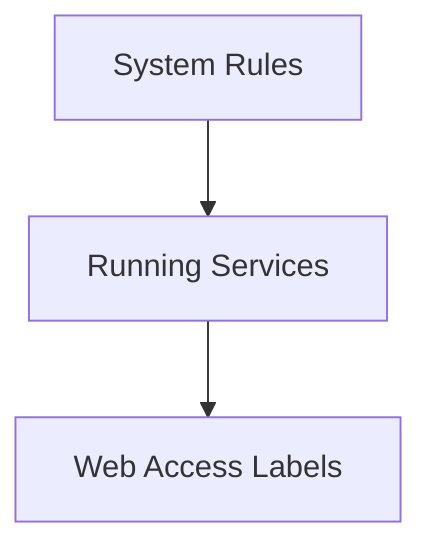

# 🏗️ Systems & Infrastructure

<div align="center">


</div>

## 🐳 Packaged Versions (Docker)

We use a tool called Docker to package the system so it runs exactly the same way on every computer.

| Part | Role |
| :--- | :--- |
| **Learning Engine** | Runs the math process to train the system. |
| **Prediction Engine** | Makes the results available to the web. |
| **Web Screen** | Provides the user interface. |

### Starting Everything Together

```bash
# Start all parts of the system at once
docker compose -f infra/docker/docker-compose.yml up --build -d
```

---

## ☸️ Advanced Setup (Kubernetes)

For more advanced setups, we provide files to run the system in a cluster environment.


```mermaid
graph TD
    A["System Rules"] --> B["Running Services"]
    B --> C["Web Access Labels"]
```

### Accessing the System

When running in a cluster, different parts are available at specific local addresses:

* **Web App**: `http://localhost:30880`
* **Prediction Service**: `http://localhost:30800`
* **Dashboard**: `http://localhost:30300`

---

## 🛡️ Reliability Guarantees

* **Checked Manifests**: All setup files are checked for errors before they are used.
* **Isolated Parts**: Different parts of the system are kept separate so they don't interfere with each other.
