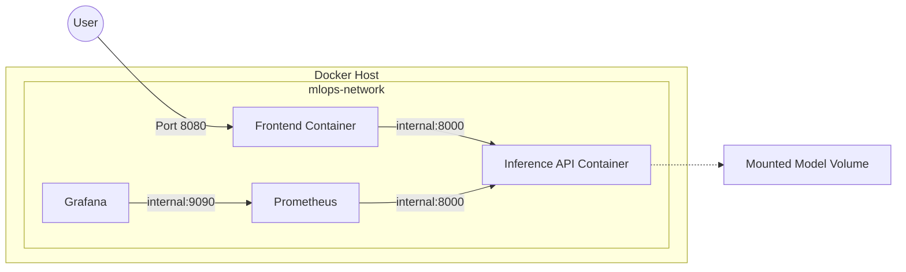

# 🏗️ Infrastructure & Deployment

<div align="center">


**Production-grade infrastructure definitions.**
*Contains verified configuration code. Runtime requires container environment.*

[⬅️ Back to Root](../README.md)

</div>

> [!WARNING]
> **Advanced Section**: This requires **Docker Desktop** installed and running. If you just want to run the app locally, stick to the [Root README](../README.md) instructions.

---

## 🌐 Network Topology (Docker Compose)

The services interact within a private Docker network (`mlops-network`).


```mermaid
graph LR
    subgraph "Docker Host"
        subgraph "mlops-network"
            Frontend[Frontend Container]
            API[Inference API Container]
            Prom[Prometheus]
            Graf[Grafana]
        end
    end

    User((User)) -- Port 8080 --> Frontend
    Frontend -- internal:8000 --> API
    Prom -- internal:8000 --> API
    Graf -- internal:9090 --> Prom
    
    API -.-> Model[Mounted Model Volume]
```

---

## 🧠 Design Decisions (Security & Scale)

| Decision | Rationale |
| :--- | :--- |
| **Non-Root User** | All Dockerfiles create an `appuser` (UID 1000). If a container is compromised, the attacker does not gain Root access to the host. |
| **Multi-Stage Builds** | We use multi-stage builds (though simple now) to keep image sizes down by only including runtime dependencies. |
| **K8s NodePorts** | For simplicity in this demo, we use NodePorts. In a real cloud setup, these would be `LoadBalancer` or `Ingress` resources. |
| **Pinned Base Images** | `python:3.11-slim` is used universally. Ensures OS-level consistency between Training and Inference. |

---

## 🐳 Docker Deployment

### Running via Compose

```bash
docker compose -f infra/docker/docker-compose.yml up --build
```

### Services Map

| Service | Internal Port | External Port | URL |
| :--- | :--- | :--- | :--- |
| `api` | 8000 | 8000 | `localhost:8000` |
| `frontend` | 80 | 8080 | `localhost:8080` |
| `prometheus`| 9090 | 9090 | `localhost:9090` |
| `grafana` | 3000 | 3000 | `localhost:3000` |

---

## ☸️ Kubernetes Deployment

Manifests are located in `infra/k8s/`.

### Verification (Dry Run)

You can validate the manifests without a cluster:

```bash
kubectl apply --dry-run=client -f infra/k8s/
```

---

## 📁 Directory Manifest

| Directory/File | Description |
| :--- | :--- |
| `docker/` | Dockerfiles and `docker-compose.yml`. |
| `k8s/` | Kubernetes YAML manifests (Deployments, Services, ConfigMaps). |
| `k8s/namespace.yaml` | Isolates resources into `mlops-system` namespace. |

---

## ❓ Troubleshooting

| Issue | Cause | Fix |
| :--- | :--- | :--- |
| `Daemon not reachable` | Docker is not running. | Start Docker Desktop. |
| `Port 8000 already allocated` | Another service is using the port. | Stop other services or change mapping in `docker-compose.yml`. |
| `OOMKilled` | Container ran out of memory. | Increase Docker Desktop memory limit. |
