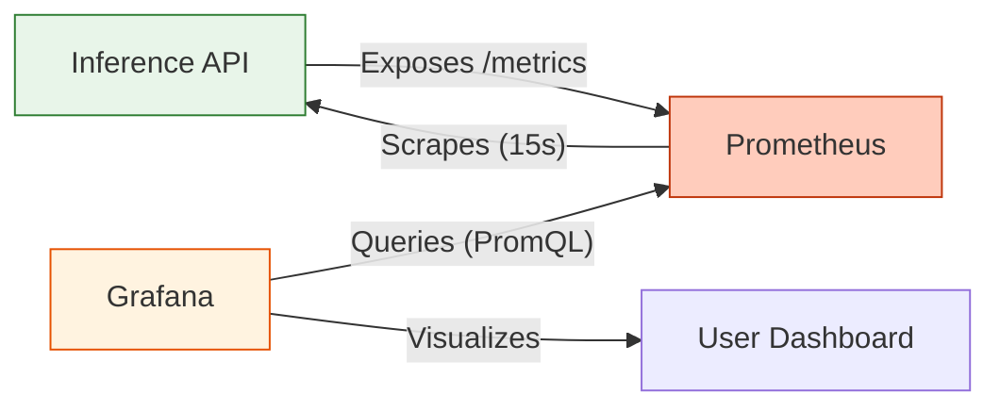
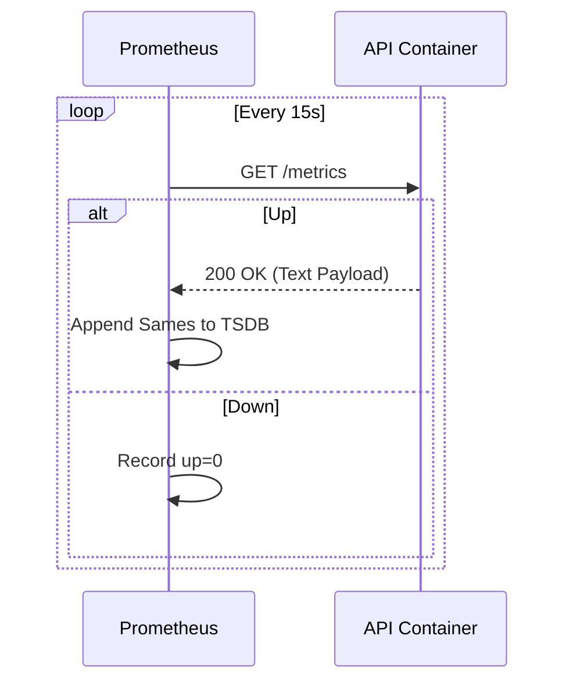

# 📊 System Monitoring & Observability

<div align="center">


**Full-stack observability for model performance, system health, and business metrics.**
*Requires Docker Environment.*

[⬅️ Back to Root](../README.md)

</div>

---

## 1. Executive Overview

### Purpose

The Monitoring stack provides "Glass Box" visibility into the MLOps system. It tracks not just standard system metrics (CPU/RAM) but also **Model Performance indicators** and **Business Logic events**.

### Business Problem

* **Silent Failures**: The API returns 200 OK, but the model is predicting "0.0" for everyone.
* **Latency Creep**: The service is getting slower over time, but no one notices until it times out.
* **Capacity Planning**: No data on requests per second (RPS) to justify scaling decisions.

### Solution

We utilize a standard **Pull-Based** architecture:

* **Inference API**: Exposes a `/metrics` endpoint (Prometheus format).
* **Prometheus**: Scrapes the API every 15 seconds and stores time-series data.
* **Grafana**: Queries Prometheus and visualizes data on pre-provisioned dashboards.

### Architectural Positioning

Observability is a **Cross-Cutting Concern**. It touches every service but resides in its own isolated infrastructure (Sidecars).

---

## 2. System Context & Architecture

### System Context



### Interactions

* **Prometheus -> API**: HTTP GET (`/metrics`).
* **Grafana -> Prometheus**: HTTP GET (Query API).
* **User -> Grafana**: HTTP GUI (Port 3000).

### Design Principles

* **Infrastructure as Code (IaC)**: Dashboards and Datasources are provisioned via files, not UI clicks.
* **RED Method**: We standardly track **R**ate, **E**rrors, and **D**uration for all services.

---

## 3. Component-Level Design

### Modules

| Service | Configuration | Role |
| :--- | :--- | :--- |
| **Prometheus** | `prometheus.yml` | The Time-Series Database (TSDB). Defines *what* to scrape. |
| **Grafana** | `provisioning/` | The Visualization Engine. Reads dashboards from JSON files. |

---

## 4. Data Design

### Metrics Schema

The Inference Service exports **Custom Metrics** in addition to standard system metrics.

| Metric Name | Type | Description | Use Case |
| :--- | :--- | :--- | :--- |
| **`api_request_total`** | Counter | Total number of HTTP requests. Labels: `method`, `endpoint`, `http_status`. | **Traffic & Errors**: Calculate Error Rate (5xx / Total) and Throughput (RPS). |
| **`api_prediction_total`** | Counter | Total successful predictions. | **Business Value**: Track how many predictions are actually being served. |
| **`api_request_duration_seconds`** | Histogram | Latency distribution buckets. | **Latency SLA**: Calculate P95 and P99 latency. |
| **`model_info`** | Gauge | Information about the currently loaded model. Label: `version`. | **Lineage**: Track when a model rollout occurred visually on dashboards. |

### Data Retention

* **Local**: Prometheus retains data for 15 days (default) in the `prometheus-data` Docker volume.

---

## 5. API Design (Consumer)

### Interfaces

* **Scrape Target**: The stack expects any service to expose `/metrics` on its main port.
* **Query API**: Grafana talks to Prometheus V1 API (`/api/v1/query_range`).

---

## 6. Execution Flow

### Scrape Loop



---

## 7. Infrastructure & Deployment

### Runtime

* **Docker**: Both services run as unprivileged containers (User 1000).
* **Network**: They share the `mlops-network` to reach the API.

### Configuration

* **Prometheus**: Mapped via `infra/monitoring/prometheus.yml`.
* **Grafana**: Dashboards mapped via `infra/monitoring/grafana/`.

---

## 8. Security Architecture

### Defenses

* **Isolation**: Monitoring tools run on a separate port range (9090, 3000) and can be firewalled differently than the App (8000).
* **Read-Only**: Grafana is configured to allow viewing but (ideally) not editing dashboards to prevent drift (Dashboards as Code).
* **Auth**: Grafana is password-protected (default: `admin`/`changeme`).

---

## 9. Performance & Scalability

* **Scrape Interval**: Set to 15s. Lowering this increases CPU/Storage cost but improves resolution.
* **Cardinality**: We avoid high-cardinality labels (like `Patient_ID`) in metrics to prevent memory explosions in Prometheus.

---

## 10. Reliability & Fault Tolerance

* **Persistent Storage**: Docker Volumes ensures monitoring history survives container restarts.
* **Self-Monitoring**: Prometheus tracks its own health (`prometheus_build_info`, `scrape_duration_seconds`).

---

## 11. Observability

* **Alerting**: (Future) Prometheus AlertManager can trigger Slack/PagerDuty notifications on high error rates.

---

## 12. Testing Strategy

* **Verification**: `up` metric in Prometheus must be `1` for the inference service.
* **Access Check**: `curl localhost:9090/-/healthy`.

---

## 13. Configuration

| Env Variable | Context | Default |
| :--- | :--- | :--- |
| `GF_SECURITY_ADMIN_PASSWORD` | Grafana | `changeme` |
| `PROMETHEUS_YML` | Volume Mount | `monitoring/prometheus.yml` |

---

## 14. Development Guide

### Prerequisites

* Docker Desktop installed.

### Running the Stack

```bash
docker compose -f infra/docker/docker-compose.yml up -d prometheus grafana
```

### Access Points

1. **Prometheus UI**: `http://localhost:9090`
    * *Usage*: Debug raw queries (`rate(api_request_total[1m])`).
2. **Grafana UI**: `http://localhost:3000`
    * *Creds*: `admin` / `admin` (or configured value).
    * *Dashboard*: Go to **Dashboards > General > Inference Service Health**.

---

## 15. Future Improvements

* **Loki**: Integrate for log aggregation alongside metrics.
* **AlertManager**: Configure email alerts for P99 latency > 200ms.

---
