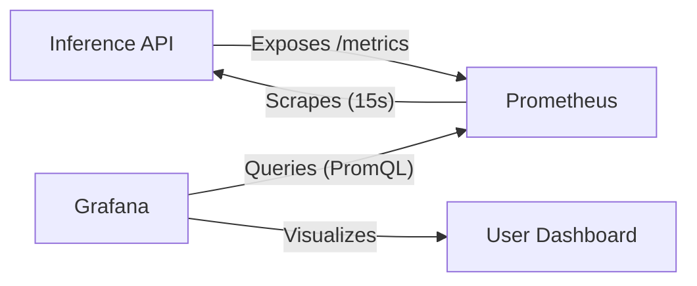

# 📊 System Monitoring

<div align="center">


**Observability stack for model performance and system health.**
*Requires Docker environment.*

[⬅️ Back to Root](../README.md)

</div>

> [!WARNING]
> **Advanced Section**: This requires **Docker Desktop** installed and running. If you do not have Docker, you cannot run Grafana/Prometheus locally.

---

## 📡 Metric Aggregation Architecture

We use a **Pull-based** monitoring architecture standard in the industry.


```mermaid
graph LR
    App[Inference API] -- Exposes /metrics --> Prom[Prometheus]
    Prom -- Scrapes (15s) --> App
    Graf[Grafana] -- Queries (PromQL) --> Prom
    Graf -- Visualizes --> Dashboard[User Dashboard]
```

---

## 🧠 Design Decisions

| Decision | Rationale |
| :--- | :--- |
| **Prometheus (Pull)** | The standard for K8s monitoring. Allows the monitoring system to decide *when* to check health, rather than being bombarded by app push events. |
| **Custom Metrics** | We don't just track CPU/RAM. We track business logic (`api_prediction_total`, `model_version`). This is critical for MLOps. |
| **Grafana Provisioning** | Data sources and dashboards are "Infrastructure as Code" (YAML). We don't manually click to set them up. |

---

## 📈 Key Metrics

The Inference API (`inference/app.py`) exports these custom metrics:

| Metric Name | Type | Description | Purpose |
| :--- | :--- | :--- | :--- |
| `api_request_total` | Counter | Total requests by endpoint/status | Measure Traffic & Error Rates (RED Method). |
| `api_prediction_total` | Counter | Total successful predictions | Measure Business Throughput. |
| `api_request_duration_seconds`| Histogram | Latency distribution | Measure Performance (P95/P99 latency). |
| `model_info` | Gauge | Active model version | Track Deployments/Rollbacks. |

---

## 🚀 How to Run

These services run as sidecars in the Docker Compose stack.

```bash
docker compose -f infra/docker/docker-compose.yml up prometheus grafana
```

### Access Points

* **Prometheus**: `http://localhost:9090`
* **Grafana**: `http://localhost:3000` (Default creds: `admin` / `mlops2024`)

---

## 📁 Directory Manifest

| File | Description |
| :--- | :--- |
| `prometheus.yml` | Configuration file telling Prometheus where to scrape (target: `inference:8000`). |
| `grafana/` | (If present) Contains dashboard JSONs for auto-provisioning. |

---

## ❓ Troubleshooting

| Issue | Cause | Fix |
| :--- | :--- | :--- |
| `Target Down` in Prometheus | API container is not running or unreachable. | Check `docker ps`. Ensure API is on the same network. |
| `Empty Dashboard` | No traffic generated yet. | Send some requests to the API using `curl` or the Frontend. |
