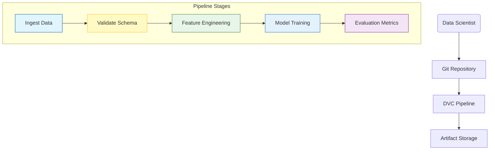
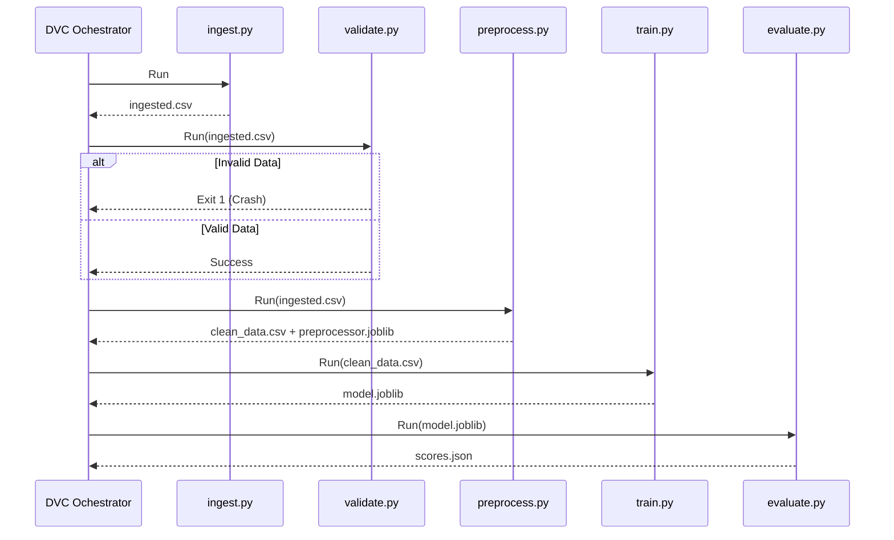

# 🏗️ Data & Model Pipeline

<div align="center">


**A reproducible, deterministic DAG for transforming raw data into production-ready models.**
*Managed via DVC.*

[⬅️ Back to Root](../README.md)

</div>

---

## 1. Executive Overview

### Purpose

The Pipeline is the "Data Factory" of the MLOps system. It automates the end-to-end process of ingesting raw data, validating quality, engineering features, training a model, and evaluating its performance.

### Business Problem

Manual model training is fraught with risk:

* **Hidden Dependencies**: "It works on my machine" often means "It works with my specific unversioned local CSV".
* **Lack of Lineage**: Impossible to trace a production model back to the specific dataset rows that trained it.
* **Silent Failures**: Models trained on bad data (e.g., negative ages) may mathematically converge but be practically useless.

### Solution

This pipeline implements:

* **Deterministic Execution**: Every run with the same inputs produces the same outputs (Fixed Seeds).
* **Artifact Traceability**: Every model is cryptographically linked to its input data via DVC.
* **Fail-Fast Quality Gates**: Invalid data crashes the pipeline immediately.

### Architectural Positioning

It operates as an **Offline Batch System**. It does not serve traffic but produces the *Artifacts* (Model, Preprocessor) that the **Inference Service** consumes.

---

## 2. System Context & Architecture

### System Context



### Interactions

* **Git**: Tracks code (`.py`) and stage definitions (`dvc.yaml`).
* **DVC**: Tracks data hashes (`dvc.lock`) and orchestrates execution.
* **Local Storage**: Stores the actual large files (`data/`, `models/`).

### Design Principles

* **Atomic Stages**: Each script (`ingest.py`, `train.py`) does exactly one thing.
* **Idempotency**: Re-running a successful stage with no input changes results in a No-Op (Cache hit).

---

## 3. Component-Level Design

### Core Modules

| Module | Responsibility | Dependencies | Public Interface |
| :--- | :--- | :--- | :--- |
| `ingest.py` | **ETL**. Copies data to workspace. | `pandas` | `data/processed/ingested.csv` |
| `validate.py` | **QA**. Enforces schema constraints. | `params.yaml` | Exit Code 0 or 1 |
| `preprocess.py` | **Feature Eng**. One-Hot, Scaling. | `sklearn` | `preprocessor.joblib` |
| `train.py` | **Modeling**. Fits Random Forest. | `sklearn` | `model.joblib` |
| `evaluate.py` | **Reporting**. Calculates metrics. | `json` | `metrics/scores.json` |

---

## 4. Data Design

### Schema Structure

Data validation is enforced by `validate.py` using `params.yaml`.

* **Age**: Int [18, 79]
* **Gender**: Enum [Male, Female]
* **Condition**: Enum [Diabetes, Hypertension, ...]
* **Treatment_Duration**: Int [5, 59]

### Artifacts (DTOs)

* **Intermediate**: `clean_data.csv` (Features + Target).
* **Final**: `model.joblib` (RandomForestRegressor), `preprocessor.joblib` (ColumnTransformer).

---

## 5. Execution Flow

### Pipeline DAG

The execution flow is a Direct Acyclic Graph (DAG) managed by DVC.



---

## 6. Infrastructure & Deployment

### Runtime

* **Environment**: Python 3.10+ (Virtualenv or Docker).
* **Resource Management**: Customizable `n_jobs` for parallelism.

---

## 7. Security Architecture

### Data Protection

* **Pseudonymization**: The pipeline expects `Patient_ID` to be pseudonymized (e.g., `P0001`) before ingestion.
* **Access Control**: Access to raw data in `data/raw` should be restricted via filesystem permissions (outside scope of this repo code).

---

## 8. Performance & Scalability

* **Streaming**: `ingest.py` supports chunked reading (conceptually) to handle large CSVs.
* **Parallelism**: Training supports multi-core execution via `N_JOBS`.

---

## 9. Reliability & Fault Tolerance

* **Resume Capability**: DVC caches intermediate results. If `Train` fails, fixing it and re-running `dvc repro` will skip `Ingest` and `Preprocess`.
* **Deterministic**: Fixed seeds (`random_state=42`) prevent "flaky" training runs.

---

## 10. Observability

### Metrics

* **Experiment Tracking**: `metrics/scores.json` (RMSE, MAE, R2).
* **Logs**: All scripts use `logging` module with standardized format.

---

## 11. Testing Strategy

* **Unit Tests**: `pytest` checks individual transformation functions.
* **Integration Tests**: `dvc repro` acts as an end-to-end integration test.

---

## 12. Configuration Table

| Parameter | Default | Description |
| :--- | :--- | :--- |
| `schema` | `...` | Valid values for input columns. |
| `n_estimators` | `100` | Number of trees in Random Forest. |
| `test_size` | `0.2` | Fraction of data used for evaluation. |

---

## 13. Development Guide

### Running the Pipeline

```bash
# Full execution
dvc repro

# Force re-run from scratch
dvc repro --force
```

### Adding a Stage

1. Create `pipelines/new_stage.py`.
2. Add definition to `dvc.yaml` with `deps` and `outs`.

---

## 14. Future Improvements

* **Hyperparameter Tuning**: Integrate with Hydra or Optuna.
* **Distributed Training**: Add Spark/Dask support for TB-scale datasets.

---
