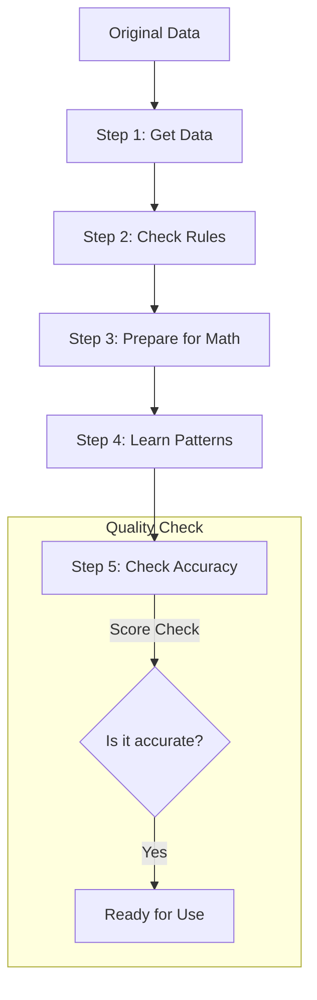

# 🏗️ Step-by-Step Workflow

<div align="center">


</div>

## 🛣️ Workflow Overview

Our workflow is organized into logical steps. If you change a small part of the data, the system automatically knows which steps need to be re-run to keep everything up to date.


```mermaid
graph TD
    A["Original Data"] --> B["Step 1: Get Data"]
    B --> C["Step 2: Check Rules"]
    C --> D["Step 3: Prepare for Math"]
    D --> E["Step 4: Learn Patterns"]
    E --> F["Step 5: Check Accuracy"]

    subgraph "Quality Check"
        F -- "Score Check" --> G{"Is it accurate?"}
        G -- "Yes" --> H["Ready for Use"]
    end
```

---

## 🔬 What happens at each step?

### 1️⃣ Get Data (`ingest.py`)

This step finds the original patient data and moves it into a workspace while checking that no data is missing.

### 2️⃣ Check Rules (`validate.py`)

This step makes sure every patient record makes sense. For example, it checks if ages are within expected ranges.

### 3️⃣ Prepare for Math (`preprocess.py`)

This step translates medical terms (like drug names) into numbers that the prediction model can understand.

---

## 🏃 Running the Workflow

```bash
# Run the whole workflow from start to finish
dvc repro

# See a picture of the steps
dvc dag
```

---

## 🛡️ Reliability Features

* **Central Rules**: All steps use the same rulebook (`params.yaml`).
* **Smart Skipping**: If nothing has changed, the system is smart enough to skip steps to save time.
