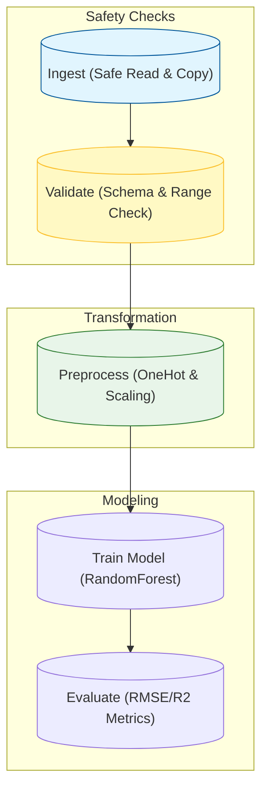

# 🏗️ Data Pipelines

<div align="center">


**Reproducible, step-by-step data processing.**
*Verified for local execution.*

[⬅️ Back to Root](../README.md)

</div>

---

## 🛤️ Execution Flow (DAG)

The pipeline is defined in `dvc.yaml` and executes in verified stages. This Direct Acyclic Graph (DAG) ensures that if `Ingest` fails, `Train` never runs.


```mermaid
graph TD
    subgraph "Safety Checks"
        Ingest[("Ingest (Safe Read & Copy)")] --> Validate[("Validate (Schema & Range Check)")]
    end

    subgraph "Transformation"
        Validate --> Preprocess[("Preprocess (OneHot & Scaling)")]
    end

    subgraph "Modeling"
        Preprocess --> Train[("Train Model (RandomForest)")]
        Train --> Evaluate[("Evaluate (RMSE/R2 Metrics)")]
    end
    
    style Ingest fill:#e1f5fe,stroke:#01579b
    style Validate fill:#fff9c4,stroke:#fbc02d
    style Preprocess fill:#e8f5e9,stroke:#2e7d32
```

---

## 🧠 Design Decisions

| Pattern | Rationale |
| :--- | :--- |
| **Fail-Fast Validation** | The `validate.py` stage runs *before* preprocessing. If data is bad, we crash early. This saves compute resources. |
| **Constant Memory** | `ingest.py` uses chunked reading (or `nrows` sampling for checks) to ensure we can handle datasets larger than RAM. |
| **Artifact separation** | We save `preprocessor.joblib` separate from `model.joblib`. This allows the Inference API to apply the *exact same* transformations to new data. |
| **Atomic Stages** | Each script does exactly one thing. This makes debugging easier ("Did it fail at Ingest or Train?"). |

---

## 🚀 How to Run

### Execute Full Pipeline

Re-runs any steps where dependencies (code or data) have changed.

```bash
dvc repro
```

*Or use `make run-pipeline` for a clean environment run.*

---

## 🔬 Stage Details

### 1. Ingest (`pipelines/ingest.py`)

* **Input**: `data/raw/real_drug_dataset.csv`
* **Action**: Copies data to workspace, validating file integrity.
* **Safety**: Uses constant-memory checks.

### 2. Validate (`pipelines/validate.py`)

* **Input**: `data/processed/ingested.csv`
* **Action**: Enforces `params.yaml` schema (Ranges, Types, Categories).
* **Behavior**: Fail-fast. Any schema violation stops the pipeline immediately.

### 3. Preprocess (`pipelines/preprocess.py`)

* **Input**: `data/processed/clean_data.csv`
* **Action**: One-hot encoding, Scaling, Train/Test split.
* **Artifacts**: Saves `preprocessor.joblib`.

---

## 📁 Directory Manifest

| File | Description |
| :--- | :--- |
| `ingest.py` | Initial data loader. |
| `validate.py` | Schema enforcement logic. |
| `preprocess.py` | Feature engineering logic. |
| `__init__.py` | Makes directory a Python package. |

---

## ❓ Troubleshooting

| Error | Cause | Fix |
| :--- | :--- | :--- |
| `Stage 'ingest' cmd failed` | Input file missing or locked. | Check `data/raw` exists and is readable. |
| `SchemaViolationError` | Data contains values not in `params.yaml`. | Fix the raw data or update the allowed values in `params.yaml`. |
| `MemoryError` | Dataset too large for pandas. | Increase RAM or optimize `ingest.py` to use `dask`/`chunksize`. |
