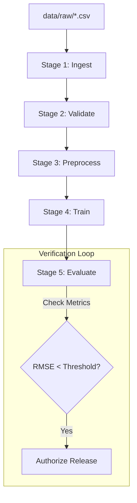

# 🏗️ MLOps Lifecycle Pipelines

<div align="center">


</div>

## 🛣️ Pipeline Overview

Our pipeline is a directed acyclic graph (DAG) managed by DVC. This ensures that a change in the dataset automatically triggers a re-run of all downstream stages, guaranteeing that the model artifact always reflects current data.


```mermaid
graph TD
    A["data/raw/*.csv"] --> B["Stage 1: Ingest"]
    B --> C["Stage 2: Validate"]
    C --> D["Stage 3: Preprocess"]
    D --> E["Stage 4: Train"]
    E --> F["Stage 5: Evaluate"]

    subgraph "Verification Loop"
        F -- "Check Metrics" --> G{"RMSE < Threshold?"}
        G -- "Yes" --> H["Authorize Release"]
    end
```

---

## 🔬 Stage Breakdown

### 1️⃣ Ingest (`ingest.py`)

Copies the raw clinical data into the processed zone and performs a shallow audit (row count vs. expectation).

* **Input**: `data/raw/real_drug_dataset.csv`
* **Output**: `data/processed/ingested.csv`

### 2️⃣ Validate (`validate.py`)

The logic gate for data quality. It enforces the schema defined in `params.yaml`.

* **Action**: Drops rows with out-of-range Ages or invalid Drug Names.
* **Guarantee**: Prevents training on "impossible" clinical data.

### 3️⃣ Preprocess (`preprocess.py`)

Transforms clinical strings into ML-ready matrices.

* **Logic**: StandardScaling for numeric values, OneHotEncoding for categories.
* **Artifact**: Generates `preprocessor.joblib` (Critical for Inference).

---

## 🏃 Operation

```bash
# Execute the authoritative DAG
dvc repro

# Examine the pipeline graph
dvc dag
```

---

## 🛡️ Reliability Features

* **Schema Rigidity**: All stages load column names from a central `params.yaml`. A single typo in the data will be caught at Stage 2.
* **Stateful Tracking**: If `ingested.csv` has not changed since the last run, DVC will skip Stages 1-5, saving compute resources.
