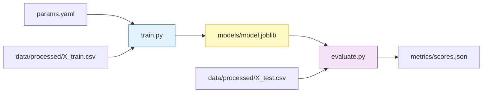

# 🧠 Model Training & Evaluation Logic

<div align="center">


**The core algorithmic engine. Trains, validates, and serializes the clinical prediction model.**
*Deterministic. Reproducible. Interpretable.*

[⬅️ Back to Root](../README.md)

</div>

---

## 1. Executive Overview

### Purpose

This module contains the pure Python logic for training the machine learning model (`train.py`) and evaluating its performance (`evaluate.py`). It transforms preprocessed data into a serialized artifact ready for production inference.

### Business Problem

* **Black Box AI**: Clinicians often distrust models they cannot understand.
* **Overfitting**: Models that memorize training data fail dangerously on real patients.
* **Resource Waste**: Training large ensembles can crash production nodes if CPU/RAM usage isn't controlled.

### Solution

* **White-Box Algorithms**: We strictly use **Random Forest Regressors**, which provide feature importance scores (interpretability) unlike opaque Neural Networks.
* **Strict Regularization**: Hyperparameters like `max_depth` and `min_samples_leaf` are enforced via `params.yaml` to prevent overfitting.
* **Resource Safety**: The training script respects `N_JOBS` environment variables to strictly limit CPU parallelism in containerized environments.

### Architectural Positioning

This module acts as the **Compute Kernel** of the MLOps pipeline. It is invoked purely by the Pipeline Orchestrator (DVC) and has no external network dependencies.

---

## 2. System Context & Architecture

### Data Flow



### Interactions

* **Input**: Consumes strictly schema-validated, preprocessed CSVs from `data/processed/`.
* **Control**: Controlled via `params.yaml` (Hyperparameters).
* **Output**: Produces binary artifacts (`.joblib`) and JSON metrics.

---

## 3. Component-Level Design

### Core Scripts

| Script | Responsibility | Key Libraries | Output |
| :--- | :--- | :--- | :--- |
| `train.py` | **Model Fitting**. Loads data, initializes generic regressor, fits to training set, logs feature importance. | `sklearn.ensemble`, `joblib` | `models/model.joblib` |
| `evaluate.py` | **Model Validation**. Loads model, predicts on hold-out set, calculates RMSE/MAE/R². | `sklearn.metrics`, `json` | `metrics/scores.json` |

### Algorithmic Choice: Random Forest

We selected Random Forest over Gradient Boosting or Neural Networks for this clinical use case:

1. **Tabular Data Performance**: Random Forests excel at tabular medical data with mixed categorical/numeric features.
2. **Outlier Robustness**: Less sensitive to extreme dosage/age outliers than Linear Regression.
3. **Default Safety**: Harder to incredibly overfit compared to Gradient Boosting (XGBoost).

---

## 4. Observability & Logging

### Console Logging

The scripts define a custom logger format:
`%(asctime)s | %(levelname)s | %(name)s | %(message)s`

**Example Output:**

```text
2026-02-17 14:00:00 | INFO | train | Training on 800 samples, 45 features...
2026-02-17 14:00:05 | INFO | train | Top Feature: Drug_Dosage (0.34)
2026-02-17 14:00:10 | INFO | train | Model saved to models/model.joblib
```

### Interpretability

`train.py` automatically calculates and logs the **Top 10 Feature Importances** to stdout. this allows ML Engineers to sanity-check the model (e.g., if "Patient_ID" is a top feature, something is wrong).

---

## 5. Configuration Strategy

Hyperparameters are decoupled from code. Change `params.yaml` to tune the model, avoiding code edits.

| Parameter | Default | Effect |
| :--- | :--- | :--- |
| `n_estimators` | `100` | More trees = more stable, slower training. |
| `max_depth` | `15` | Limits tree growth. Prevents memorization. |
| `min_samples_leaf` | `2` | Ensures leaf nodes represent at least N patients. |

---

## 6. Development Guide

### Running Locally

```bash
# Optimized for local development (uses all cores)
export N_JOBS=-1
python training/train.py
```

### Running in CI/CD

```bash
# Optimized for shared runner (uses 1 core)
export N_JOBS=1
python training/train.py
```

---

## 7. Future Improvements

* **Hyperparameter Search**: Integrate `optuna` for automated Bayesian optimization.
* **Model Registry**: Push trained `.joblib` files to S3/MLflow instead of local disk.
* **Explainability**: Generate SHAP plots in `evaluate.py` for deeper model explanation.
