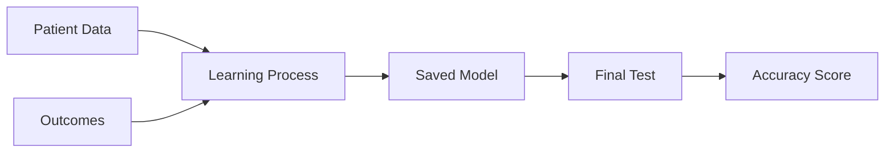

# 🧠 Patient Outcome Learning

<div align="center">


</div>

## 🧬 Consistency Rules

The system is designed to learn from data in a predictable way. This means that if you train it twice on the same data, you will get the exact same results every time.

### Saving the Results

When the learning process finishes, it saves two important files:

1. **The Learnings** (`models/model.joblib`): What the system has discovered about treatment results.
2. **The Recipe** (`data/processed/preprocessor.joblib`): How to prepare new patient data so the system can understand it.

---

## 🏃 How it works


```mermaid
graph LR
    X["Patient Data"] --> FIT["Learning Process"]
    Y["Outcomes"] --> FIT
    FIT --> ART["Saved Model"]
    ART --> EVAL["Final Test"]
    EVAL --> METRICS["Accuracy Score"]
```

### Commands

```bash
# Start the learning process
dvc repro train

# Test how accurate it is
dvc repro evaluate
```

---

## 📋 How we measure success

We use three standard ways to check if our predictions are accurate:

| Metric | Goal | Simple Explanation |
| :--- | :--- | :--- |
| **Error Margin** | Low | How close the prediction is to the actual result. |
| **Consistency** | High | How well the system handles different types of patients. |
| **Reliability** | High | Percentage of results that follow the predicted pattern. |

---

## 🛠️ System Settings

We have pre-configured the system with settings that work best for this clinical data. These are stored safely in `params.yaml`.

## 🧪 Advanced Tuning

For advanced users, we provide a script (`training/tune.py`) that tries thousands of different setting combinations to find the absolute most accurate configuration possible.
