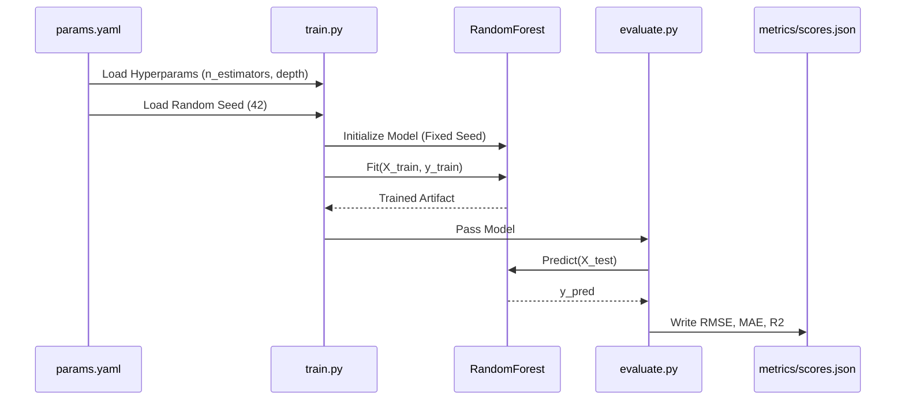

# 🧠 Model Training

<div align="center">


**Deterministic model training pipeline.**
*Verified for local execution.*

[⬅️ Back to Root](../README.md)

</div>

---

## 🔬 Experiment Tracking Flow

The training process is designed to be **auditable** and **reproduceable**.


```mermaid
sequenceDiagram
    participant Params as params.yaml
    participant Train as train.py
    participant Model as RandomForest
    participant Eval as evaluate.py
    participant Metrics as metrics/scores.json

    Params->>Train: Load Hyperparams (n_estimators, depth)
    Params->>Train: Load Random Seed (42)
    Train->>Model: Initialize Model (Fixed Seed)
    Train->>Model: Fit(X_train, y_train)
    Model-->>Train: Trained Artifact
    Train->>Eval: Pass Model
    Eval->>Model: Predict(X_test)
    Model-->>Eval: y_pred
    Eval->>Metrics: Write RMSE, MAE, R2
```

---

## 🧠 Design Decisions

| Decision | Rationale |
| :--- | :--- |
| **Random Forest** | Robust to outliers, handles non-linear relationships well, and interpretable via feature importance. Good baseline choice. |
| **Fixed Random Seed** | We set `random_state=42` explicitly. This ensures that if you run `dvc repro` twice, you get the *byte-for-byte exact same* model. |
| **Pinned Dependencies** | `requirements.txt` locks `scikit-learn` version. A model trained on v1.4.1 might behave differently on v1.5.0. |
| **Resource Limits** | `n_jobs` defaults to 1 but can be overridden. This prevents the training script from creating 100 threads on a shared Kubernetes node. |

---

## 🚀 How to Train

The training stage is part of the DVC pipeline:

```bash
dvc repro train
```

### Artifacts Produced

* `models/model.joblib`: The trained Random Forest model.
* `metrics/scores.json`: Performance metrics (RMSE, MAE, R²).

---

## ⚙️ Configuration

Hyperparameters are managed in `params.yaml`:

```yaml
model:
  n_estimators: 200
  max_depth: 15
  min_samples_split: 5
  min_samples_leaf: 2
```

---

## 📁 Directory Manifest

| File | Description |
| :--- | :--- |
| `train.py` | Main training logic. Loads data, trains model, saves `.joblib`. |
| `evaluate.py` | Evaluation logic. Loads model/test data, calculates metrics. |
| `__init__.py` | Package marker. |

---

## ❓ Troubleshooting

| Issue | Cause | Fix |
| :--- | :--- | :--- |
| `ValueError: Input contains NaN` | Preprocessing failed to handle missing values. | Check `pipelines/preprocess.py` logic. |
| `Low Accuracy (R2 < 0.5)` | Model underfitting or data insufficient. | Try increasing `n_estimators` in `params.yaml`. |
| `Training is slow` | Execution is single-threaded. | `export N_JOBS=-1` (Local only! Do not do this in Prod). |
