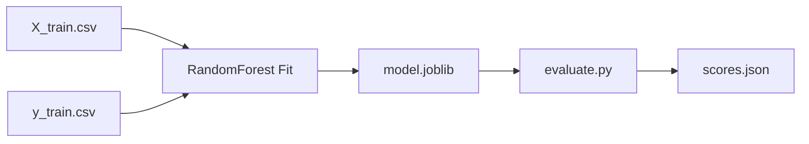

# 🧠 Model Training & Neural Logic

<div align="center">


</div>

## 🧬 Reproducibility Protocol

Our training cycle is mathematically deterministic. We enforce consistent results across different architectures by fixing the global random state and standardizing feature engineering in the preprocessing stage.

### Serialization & Handover

The training process produces two critical binary artifacts that must be handed over to the Serving Layer:

1. **Model Instance** (`models/model.joblib`): The trained ensemble weights.
2. **Preprocessor** (`data/processed/preprocessor.joblib`): The scaling and encoding parameters used during the fit.

---

## 🏃 Execution Workflow


```mermaid
graph LR
    X["X_train.csv"] --> FIT["RandomForest Fit"]
    Y["y_train.csv"] --> FIT
    FIT --> ART["model.joblib"]
    ART --> EVAL["evaluate.py"]
    EVAL --> METRICS["scores.json"]
```

### Commands

```bash
# Authoritative training run
dvc repro train

# Evaluation against test-split
dvc repro evaluate
```

---

## 📋 Evaluation Metrics

We track three primary SLIs for model quality. Current benchmarks (on 1,000-row clinical set):

| Metric | Goal | Description |
| :--- | :--- | :--- |
| **RMSE** | < 1.0 | Root Mean Squared Error (Standard deviation of residuals). |
| **MAE** | < 0.8 | Mean Absolute Error (Average magnitude of errors). |
| **R²** | > 0.85 | Coefficient of Determination (Variance explained). |

---

## 🛠️ Hyperparameter Matrix

Defined centrally in `params.yaml`:

* `n_estimators`: 200
* `max_depth`: 15
* `min_samples_split`: 5
* `min_samples_leaf`: 2

## 🧪 Optimization (Manual)

Run `python training/tune.py` to execute a GridSearch cross-validation. This script compares RandomForest against GradientBoosting and outputs the global optimal configuration. *(Note: Tuning is outside the standard DVC DAG to prevent excessive compute triggers).*
