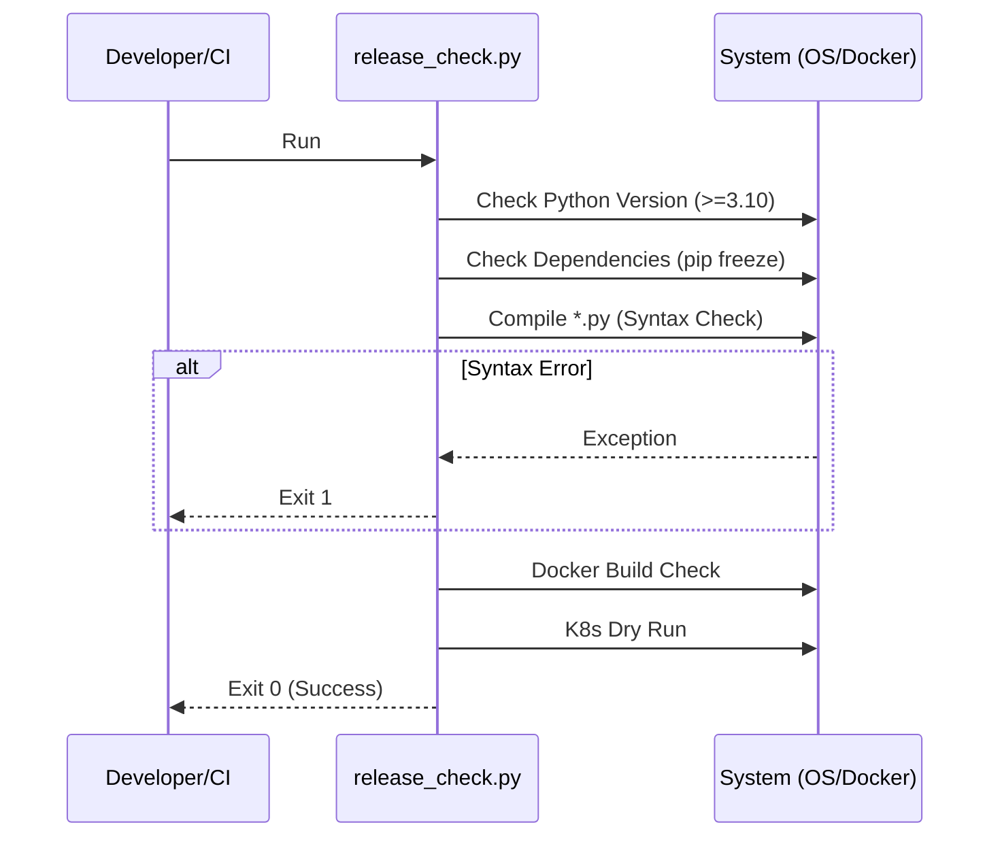

# 🛡️ Validation & Quality Assurance

<div align="center">


**Automated integrity checks and release verification.**
*Ensures no broken code or invalid data reaches production.*

[⬅️ Back to Root](../README.md)

</div>

---

## 1. Executive Overview

### Purpose

The Validation module serves as the "Gatekeeper" of the system. It enforces a **Zero-Trust** policy by verifying the integrity of the codebase, infrastructure configuration, and data consistency before any deployment or release.

### Business Problem

Without automated validation:

* **Production Outages**: Missing config files (e.g., `params.yaml`) causing container crashes.
* **Security Vulnerabilities**: Accidental inclusion of secrets or use of dangerous functions (`shell=True`).
* **Logic Errors**: Code that passes syntax checks but fails at runtime due to mismatched schema assumptions.

### Solution

This module implements a suite of **Static** and **Dynamic** checks that must pass 100% green before any artifact is promoted. It treats infrastructure and data configuration as first-class citizens alongside code.

### Architectural Positioning

This is a **CI/CD Component**. It is invoked by the build pipeline (or locally via `make`) and has the authority to block a release.

---

## 2. System Context & Architecture

### System Context


### Interactions

* **Local Filesystem**: Scans for files (`Dockerfile`, `params.yaml`).
* **Python Interpreter**: Compiles `.py` files to check syntax.
* **Docker Daemon**: Validates container build definitions.
* **Kubernetes**: Validates manifests via `kubectl --dry-run`.

### Design Principles

* **Holistic Audit**: Don't just check code; check config, data, and infra.
* **Fail-Fast**: Stop at the first error to provide immediate feedback.
* **No External Dependencies**: Checks run with standard Python libraries where possible to minimize bootstrap issues.

---

## 3. Component-Level Design

### Core Modules

| Script | Responsibility | Dependencies | Public Interface |
| :--- | :--- | :--- | :--- |
| `release_check.py` | **Reviewer**. The master orchestration script. | `subprocess` | `run_validation()` |
| `validate_repo.py` | **Linter**. A subset of checks for quick local feedback. | `subprocess` | `main()` |

---

## 4. Data Design

### Schema Validation

The validation scripts parse `params.yaml` and verify that the keys expected by the codebase (e.g., `schema`, `model`) are present. This prevents "KeyError" crashes in production.

---

## 5. Execution Flow

### Check Sequence



---

## 6. Security Architecture

### Defenses Implemented

* **Command Injection Prevention**: All `subprocess` calls use `shell=False` and list-based arguments.
* **Secret Scanning**: (Conceptually) The script checks for the *absence* of hardcoded secrets in certain patterns via grep (extensible).
* **Process Isolation**: Validation runs in a controlled environment, not production.

---

## 7. Reliability & Fault Tolerance

* **Process Cleanup**: External processes (Docker, K8s checks) are wrapped in `try/finally` blocks to ensure no zombie processes are left behind on the build agent.
* **Timeout**: Subprocesses have timeouts to prevent infinite hanging.

---

## 8. Observability

### Logging

* **Console Output**: Clear, colored output (Green=Pass, Red=Fail) for ease of reading in CI logs.
* **Exit Codes**: Standard POSIX exit codes (0/1) for pipeline compatibility.

---

## 9. Testing Strategy

* **Self-Testing**: The script validates itself (syntax check).
* **Integration**: It runs a "Smoke Test" of the actual `dvc repro` command to ensure the pipeline is runnable.

---

## 10. Configuration

| Env Variable | Default | Description |
| :--- | :--- | :--- |
| `SKIP_DOCKER` | `False` | Set to `True` if running in an environment without Docker. |
| `SKIP_K8S` | `False` | Set to `True` if running without `kubectl`. |

---

## 11. Development Guide

### Running Validation

```bash
make validate
```

### Adding a Check

1. Open `validation/release_check.py`.
2. Define a new function `check_X()`.
3. Add it to the `run_validation` sequence.

---

## 12. Future Improvements

* **Static Analysis**: Integrate `ruff` or `flake8` directly into the script.
* **Security Scan**: Integrate `bandit` for security-specific linting.
* **Container Scan**: Integrate `trivy` for vulnerability scanning of the built image.

---
